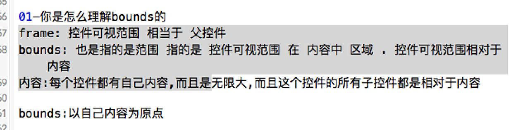
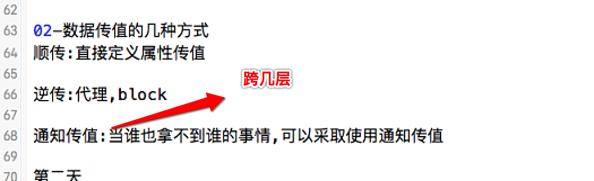

项目准备

第一天
- 01-你是怎么理解bounds的
    - 默认: x, y 都为 0
    - 一般: 设置控件本身的width 和 height
    - 特殊: 设置 bounds 的 x 和 y 值, 可以影响到其子控件的位置, 但对于其本身而言, 相对于父控件, 是没有变化的

- 02-数据传值的几种方式
    - 顺传: 给对象添加一个属性, 把值赋值给属性
    - 逆传:
        - 代理, 自己不想操作, 把这个操作交给代理来处理, 需要定义协议, 协议执行的操作, 以及什么时候调用协议
        - block, block 可以保存代码块, 使用起来跟 代理 一样, 需要定义一个 block, 什么时候调用 block, 以及设置 block 需要执行的操作

第二天

01-KVC底层怎么实现的

- 1.先去看有没有跟key值相同的成员属性,如果有,就会调用该成员属性的set方法,给该成员属性赋值.
- 2.如果没有跟它相同的成员属性的set方法, 会直接给该属性赋值.
- 3.还会去判断有没有跟它相同名称,并且带有下划线的成员属性.如果有,就给该属性赋值.
- 4.如果没有带有下划线的成员属性,就会直接报错.
例子:
```objc
 [s setValue:dict[@"source"] forKey:@"source"];

 1.首先会去模型中查找有没有setSource方法,直接调用set方法 [s setSource:dict[@"source"]];
 2.去模型中查找有没有source属性,source = dict[@"source"]
 3.去模型中查找有没有_source属性,_source = dict[@"source"]
 4.调用对象的 setValue:forUndefinedKey:直接报错
```

02-KVO底层怎么实现的
- 1、当一个object有观察者时，动态创建这个object的类的子类

- 2、对于每个被观察的property，重写其set方法

- 3、在重写的set方法中调用- willChangeValueForKey:和- didChangeValueForKey:通知观察者

- 4、当一个property没有观察者时，删除重写的方法

- 5、当没有observer观察任何一个property时，删除动态创建的子类

第三天

01-简述项目开发的步骤

02-如何做一个新的模块
