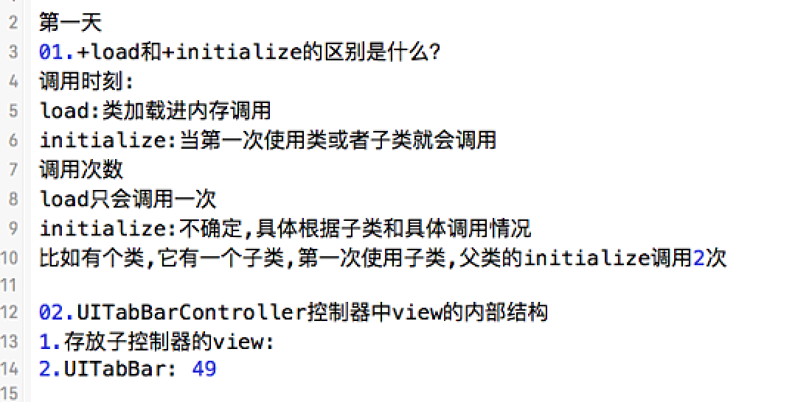
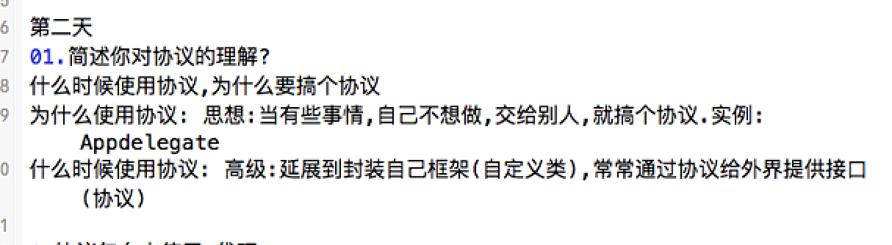
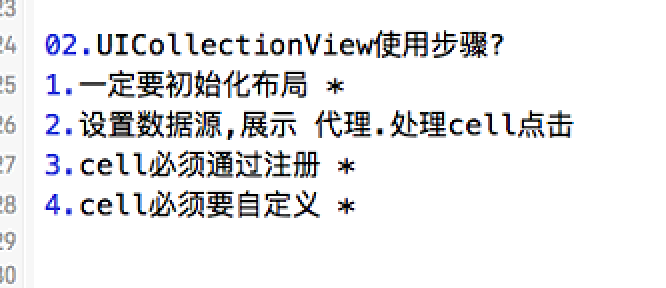
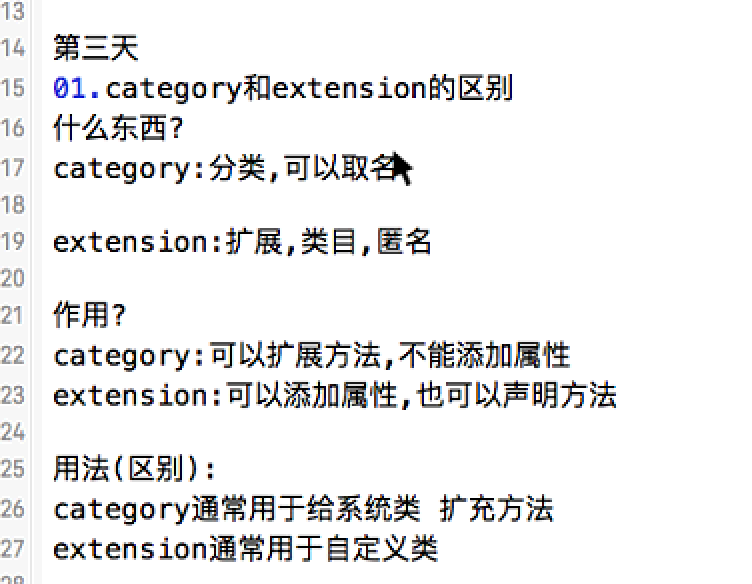
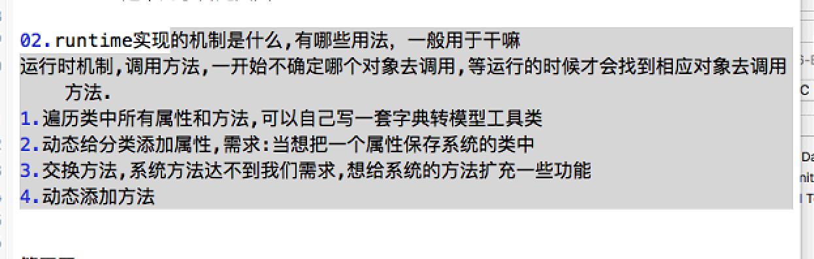
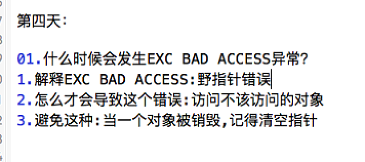
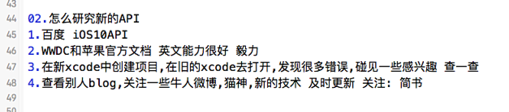
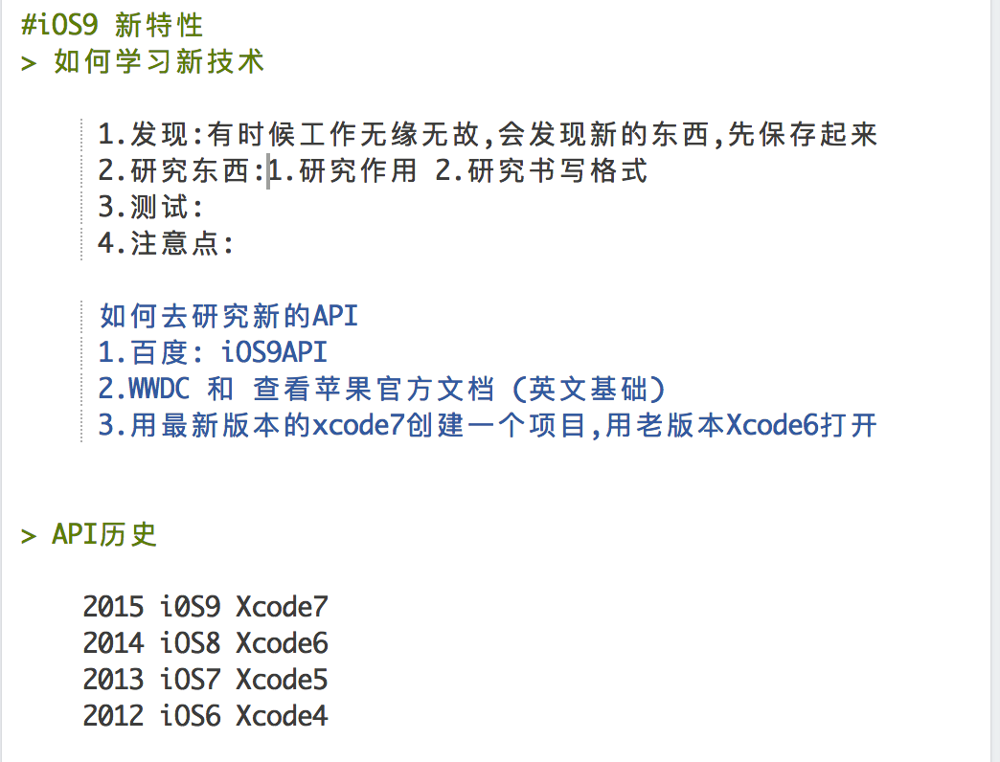

### [第一天]()


####`01.+load和+initialize的区别是什么？`(调用时刻, 调用次数)

-  两个方法都只去一次.
-  load方法是程序加载进类存的时候调用，只会调用一次，最先调用的方法
-  initialize方法是当前类或者他的子类第一次使用的时候调用，初始化一个类

####拓展
首先会先调用父类的initialize方法，如果子类没有实现initialize方法,那么父类会多次触发这个方法,为了避免这种情况的发生，可以在实现的方法里面添加一个判断：
```objc
+ (void)initialize {
    if (self == [ClassName self]) {
     // ... do the initialization ...
    }
}
```

#####选择使用的时机
- 当类的加载是耗时或者需要消耗比较多的内存的时候,尽量不要在load方法里面做这些耗时的工作,因为这样只会增加App的启动时间,降低用户的体验。
- initialize其实可以被认为是延迟加载的方法，类加载的时候并不会执行这个方法，只有当类实例化的时候，或者类的第一个方法被调用的时候才会执行这个方法


####`02.UITabBarController控制器中view的内部结构`
它view内部的结构为一个专门存放子控制器View的View,和一个UITabBar条. 注意:UITabBar的 高度为49.

####拓展
#####UINavigationController
- 导航控制器的View的结构.
	  导航控制器它是一个控制器,它肯定有一个自己的View.
	  导航控制器标志, 就是上面一个条.这个条, 我们叫它导航条.这个导航条它是显示到导航控制器View的上面.
	  导航条的Y值是20的位置开始显示,上面20是状态栏的2位置.导航条的高度是44.
	  导航控制器的View当中,还有一个转门存放子控制器的View.
	  导航控制器的View上面有两层:最外面那一层是一个导航条,导航条下面是一个存放子控制器的View.

	  导航条的Y值是20,高度是44,但是我们看到的导航条有一个半透明的效果,它是从0位置开始的.
	  它其实是导航条内部的一个子控件,它超过了导航条的高度,子控件超过父控件也是能够显示的.

### [第二天]()

####01.简述你对协议的理解?
协议是一个方法签名的列表，在其中可以定义若干个方法。根据配置，遵守该协议的类会去实现这个协议中规定的若干个方法。

####02.UICollectionView使用步骤?
- 1.初始化一个布局参数
```objc
//流水布局
    UICollectionViewFlowLayout *flowL = [[UICollectionViewFlowLayout alloc] init];
    //设置每一个格子的大小
    flowL.itemSize = CGSizeMake(100, 100);
    //设置最小行间距
    flowL.minimumLineSpacing = 50;
    //设置每个格子之间的间距
    flowL.minimumInteritemSpacing = 20;
```
- 2.手动注册UICollectionViewCell.
```objc
//使用CollectionView时必须得要注册Cell
    [self.collectionView registerClass:[UICollectionViewCell class] forCellWithReuseIdentifier:reuseIdentifier];
```
- 3.手动的去添加UICollectionViewCell的子控件,自定Cell.

### [第三天]()
####01.category和extension的区别

- 1>	分类是有名称的，类扩展没有名称
- 2>	分类只能扩充方法、不能扩充成员变量；类扩展可以扩充方法和成员变量
- 3>	类扩展一般就写在.m文件中，用来扩充私有的方法和成员变量（属性）


####02.runtime实现的机制是什么,有哪些用法，一般用于干嘛

- 实现机制: 消息机制
- 用法:
    - 发送消息
    - 交换方法
    - 动态添加方法
    - 给分类添加属性
    - 字典转模型
- 一般用于干嘛:
    - 一般情况下是不会使用的, 非得已的时候才会使用
    - 用于框架


### [第四天]()

####01.什么时候会发生EXC BAD ACCESS异常？

- 什么是EXC BAD ACCESS
    - 访问了坏内存
- 什么时候会发生
    - 对象被销毁的时候, 并没有清空指针,使用该指针时就会报坏内存访问的错误

####02.怎么研究新的API



13年9月18Xcode5对应iOS7.0，14年9月Xcode6，iOS8.0
