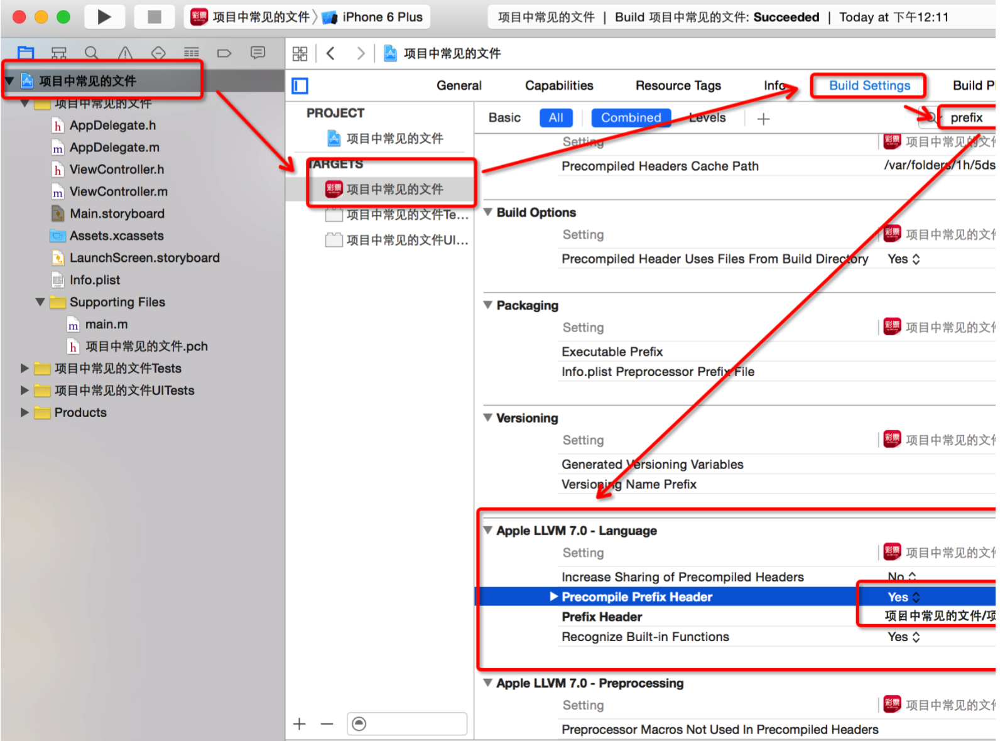

# day1
##01-项目中常见的文件(LaunchScreen)
####xcode5和xcode7区别
<ol>
<li>xcode7没有Frameworks文件夹,xcode7内部会自动帮你导入一些常见的框架.</li>
<li>xcode7多了LaunchScreen.xib,LaunchScreen.xib设置启动界面,而且可以确定模拟器或者真机的真实尺寸,如果没有设置,默认4s的尺寸(320,480)</li>
<li>xcode7没有pch文件</li>
<li>xcode5当中也有info.plist,只不过它的名字很长.是工程的名称.</li>
</ol>

####LaunchScreen启动原理
<ol>
<li>会自动加载LaunchScreen是因为在Target当中,指定了Launch Screen file,</li>
<li>如果没有设置启动图片,模拟器默认的尺寸大小是4s的尺寸大小.(可以打印屏幕尺寸验证.)</li>
<li>它的底层实现其实把LaunchScreen上的东西,生成了一张图片,然后把这张图片设为程序的启动图片</li>
</ol>


##02-项目中常见的文件(info.plist)
####info.plist文件的作用
<ol>
<li>info.plist当中保存着整个应用当中基本的配置.它是一个字典.查看它的类型.</li>
</ol>

####info.plist常见key值
<ol>
<li>Bundle Name:应用程序的名称.</li>
<li>Bundle version string,short:应用程序的版本.在开发当中都是迭代开发.苹果要求下一次提交的版本必须得要比上一次提交的版本要高.</li>
<li>Bundle Version:应用程序编译的版本.</li>
<li>Bundle identifier:应用程序标识符.保证应用程序的唯一性,</li>
</ol>


##03-项目中常见的文件(PCH)
####PCH的作用:
<ol>
<li> 存放公用的宏</li>
<li> 存放公用的头文件,分类的头文件</li>
<li> 可以自定义Log</li>
</ol>

####pch文件原理
<ol>
<li>会把pch里面的所有内容导入到每个文件中去</li>
</ol>

####配置pch文件
<ol>
<li>在Buld Setting 当中找perfix 找到Precomplie prefix Header 为yes.</li>
<li>设完这些后,再进行prefix Header的路径配置.路径从根层开始.</li>
</ol>



####自定义LOG
```objc
#ifdef DEBUG
//调试阶段

//...表示宏里面的可变参数
//__VA_ARGS__函数里面可变参数
#define XMGLog(...)  NSLog(__VA_ARGS__)

#else
//发布阶段

#define XMGLog(...)

#endif
```

####PCH文件注意点
<ol>
<li>注意PCH会把它当中的所有内容导入到工程当中所有的文件.
但如果工程当中有C语言文件的时候,它也是会把它给导入到C语言的文件当中.如果这样的话, 就会发生错误.</li>
<li>解决办法:每一个OC文件都会定义一个__OBJC__宏,只要判断有没有定义这样一个宏,
就能看出是不是C语言的文件,如果没有定义这样的宏, 那就不需要导入这些东西.就不会报错.</li>
</ol>


##04-UIApplication单例
####什么是UIApplication?
<table>
<tr>
<td>
UIApplication对象是应用程序的象征.
每一个应用都有自己的UIApplication对象,这个对象是系统自动帮我们创建的, 它是一个单例对象.
一个iOS程序启动后创建的第一个对象就是UIApplication对象
我们只能通过[UIApplication sharedApplication]获得这个单例对象,不能够手动去创建它.
</td>
</tr>
</table>

####UIApplication作用?
利用UIApplication对象，能进行一些应用级别的操作.
<ol>
<li>可以设置应用程序图标右上角的红色提醒数字</li>
<li>设置联网指示器的可见性</li>
<li>可以设置应用程序的状态栏(__需要先把控制器对状态栏的控制禁用__)</li>
<li>进行应用之间的跳转.</li>
</ol>

```objc
// 设置提醒数字
- (IBAction)bageValue:(UIButton *)sender {
    // 获取 UIApplication 对象
    UIApplication *app = [UIApplication sharedApplication];

    // 注册用户通知
    UIUserNotificationSettings *setting = [UIUserNotificationSettings settingsForTypes:UIUserNotificationTypeBadge categories:nil];
    [app registerUserNotificationSettings:setting];
    app.applicationIconBadgeNumber = self.bageNumber++;
}

// 设置网络状态
- (IBAction)netStatus:(UIButton *)sender {
    // 获取 UIApplication 对象
    UIApplication *app = [UIApplication sharedApplication];

    // 设置网络状态
    app.networkActivityIndicatorVisible = !app.networkActivityIndicatorVisible;
}

// 设置状态栏
- (IBAction)statusBar:(UIButton *)sender {
    // 需要先设置 info.plist 中的:View controller-based status bar appearance为 NO,保证不通过控制器来设置状态栏
    // 获取 UIApplication 对象
    UIApplication *app = [UIApplication sharedApplication];
    // 设置状态栏
    app.statusBarStyle = UIStatusBarStyleLightContent;
    app.statusBarHidden = YES;
}

// 以下是通过控制器来设置
- (UIStatusBarStyle)preferredStatusBarStyle{
    return UIStatusBarStyleLightContent;
}
- (BOOL)prefersStatusBarHidden{
    return YES;
}

// 打开网页
- (IBAction)openWebUrl:(UIButton *)sender {
    // 获取 UIApplication 对象
    UIApplication *app = [UIApplication sharedApplication];
    // 打开网页
    // 一定不要把协议忘记了!!!!
    NSURL *url = [NSURL URLWithString:@"http://www.baidu.com"];// 协议不要漏写
    [app openURL:url];
}
```


####模仿UIApplication单例.
要求:
<ol>
<li>程序一启动就创建创建对象.</li>
<li>创建的对象只能通过share的方式获取对象.</li>
<li>不能够进行alloc 操作,当执行alloc时, 程序发生崩溃</li>
</ol>

Person.h文件
```objc
#import <Foundation/Foundation.h>

@interface Person : NSObject

+ (Person *)sharePerson;

@end
```

Person.m 文件
```objc
#import "Person.h"

@interface Person()

/** <#注释#>*/
@property (nonatomic ,strong) Person *per;

@end

@implementation Person

static Person *_per;

//当类被加载到内存当中时,就会调用load.
+(void)load {
    //1.程序一启动,就创建一个对象
    NSLog(@"%s",__func__);

    Person *per = [[self alloc] init];
    //类方法是不能访问当前类的成员属性.
    //self.per = per;
    _per = per;
}

//2.只有一个内存地址
+ (Person *)sharePerson {
    return _per;
}

//3.当调用alloc,就会抛出异常
+(instancetype)alloc {
    if (_per) {
       NSException *exc = [NSException exceptionWithName:@"NSInternalInconsistencyException" reason:@"There can only be one Person instance." userInfo:nil];
         //抛出异常
        [exc raise];
    }
        //保持系统的默认做法
    return [super alloc];
}
@end
```

##05-UIApplication功能
####1.设置应用提醒数字
```objc
//获取UIApplication对象
UIApplication *ap = [UIApplication sharedApplication];
//在设置之前, 要注册一个通知,从ios8之后,都要先注册一个通知对象.才能够接收到提醒.
UIUserNotificationSettings *notice = [UIUserNotificationSettings  settingsForTypes:UIUserNotificationTypeBadge categories:nil];
//注册通知对象
[ap registerUserNotificationSettings:notice];
//设置提醒数字
ap.applicationIconBadgeNumber = 10;
```

####2.设置连网状态
```objc
ap.networkActivityIndicatorVisible = YES;
```

####3.设置状态栏
#####状态栏样式
```objc
//1.获取UIApplication
UIApplication *ap = [UIApplication sharedApplication];
//2.设置状态栏样式.
ap.statusBarStyle = UIStatusBarStyleLightContent;
```
#####隐藏状态栏
```objc
//1.获取UIApplication
UIApplication *ap = [UIApplication sharedApplication];
//2.设置状态的隐藏
ap.statusBarHidden = YES;
```
####4.跳转网页
#####跳转网页
```objc
UIApplication *ap = [UIApplication sharedApplication];
//URL:协议头://域名
//应用程序通过协议头的类型,去打开相应的软件.
NSURL *url =[NSURL URLWithString:@"http://www.520it.com"];
[ap openURL:url];
```
#####打电话
```objc
UIApplication *app = [UIApplication sharedApplication];
[application openURL:[NSURL URLWithString:@"tel://10086"]];
```
#####发短信
```objc
UIApplication *app = [UIApplication sharedApplication];
[app openURL:[NSURL URLWithString:@"sms://10086"]];
```

##06- UIApplication代理
####移动操作系统都有个致命的缺点
所有的移动操作系统都有个致命的缺点：app很容易受到打扰。
比如一个来电或者锁屏会导致app进入后台甚至被终止
还有很多其它类似的情况会导致app受到干扰，在app受到干扰时，会产生一些系统事件，
这时UIApplication会通知它的delegate对象，让delegate代理来处理这些系统事件

####delegate可处理的事件
<ol>
<li>应用程序的生命周期事件(如程序启动和关闭)</li>
<li>系统事件(如来电)</li>
<li>内存警告</li>
<li>...</li>
</ol>

####UIApplication代理
UIApplication会在程序一启动时候创建一个遵守UIApplicationDelegate代理.
这个就是我们程序一创建时的AppDelegate类.AppDelegate就是遵守了UIApplicationDelegate协议.
在这个类中很定义很多监听系统事件的方法.同时也定义了一些应用程序的生命周期方法.

####UIApplication代理方法
```objc
//当应用程序启动完毕时调用
- (BOOL)application:(UIApplication *)application didFinishLaunchingWithOptions:(NSDictionary *)launchOptions {
    return YES;
}

//当应用程序失去焦点时调用
- (void)applicationWillResignActive:(UIApplication *)application {
}

//当应用程序进入到后台时调用
- (void)applicationDidEnterBackground:(UIApplication *)application{
}

//当应用程序将要进入到前台时调用
- (void)applicationWillEnterForeground:(UIApplication *)application {
}

//当应用程序获取焦点时调用(获取焦点:代表能够与用户进行交互)
- (void)applicationDidBecomeActive:(UIApplication *)application {
}

//当应用程序将要终止时调用
- (void)applicationWillTerminate:(UIApplication *)application {
}

//当收到内存警告时调用
-(void)applicationDidReceiveMemoryWarning:(UIApplication *)application {
    //清理缓存
}
```

##07-应用程序的程动原理
####程序完整启动流程
<ol>
<li>执行main</li>
<li>执行UIApplicationMain,创建UIApplication对象,并设置它的代理AppDelegate</li>
<li>开启一个事件循环(死循环:保证应用程序不退出),主运行循环.</li>
<li>加载info.plist文件.加载配置信息.</li>
<li>判断Main storyboard file base name里面有没有指定Main,如果指定了Main,那么它就会自动加载指定的StoryBoard.</li>
<li>通知应用程序,调用代理方法.</li>
</ol>

main.m 说明:
<ol>
<li>第三个参数,应用程序对象的名称,它必须得是UIApplication或者是UIApplication它的子类,直接设置为nil,默认就是UIApplication</li>
<li>第四个参数:设置UIApplication代理的名称.</li>
</ol>

```objc
int main(int argc, char * argv[]) {
    @autoreleasepool {
        //第三个参数,应用程序对象的名称,它必须得是UIApplication或者是UIApplication它的子类,直接设置为nil,默认就是UIApplication
        //第四个参数:设置UIApplication代理的名称.
        //NSStringFromClass:把类名转成字符串.

        return UIApplicationMain(argc, argv, nil, NSStringFromClass([AppDelegate class]));
    }
```

##08-UIWindow

####UIWindow是什么

UIWindow是一种特殊的UIView，通常在一个app中至少有一个UIWindow
iOS程序启动完毕后，创建的第一个视图控件就是UIWindow，接着创建控制器的view，
最后将控制器的view添加到UIWindow上，于是控制器的view就显示在屏幕上了
一个iOS程序之所以能显示到屏幕上，完全是因为它有UIWindow

####加载info.plist后系统判断
- 在加载info.plist,判断下是否指定main,如果指定了,就会去加载StoryBoard.
<ol>
<li>创建一个窗口</li>
<li>加载MainStoryBoard,初始化一个控制器.</li>
<li>把初始化出来的控制器设置为窗口的根控制器.让窗口显示到屏幕上.</li>
</ol>
- 如果没有指定Mian话, 那这个时候就需要我们手动的去创建窗口.
- 当info.plist文件没有找到的时候,那么程序就加载完毕,那么在程序加载完毕时要自己手动去创建窗口.

####手动创建窗口
<ol>
<li>创建窗口,要有窗口显示,必须要有强引用.窗口也是控件,要想展示出来.必须得要有尺寸.
</li>
<li>创建控制器</li>
<li>设置控制器为窗口的根控制器</li>
<li>显示窗口</li>
</ol>

```objc
    //1.手动创建窗口
   self.window = [[UIWindow alloc] initWithFrame:[UIScreen mainScreen].bounds];

    //2.设置窗口的根控制器
    XMGViewController *VC = [[XMGViewController alloc] init];

    self.window.rootViewController = VC;

    //3.显示窗口
    [self.window makeKeyAndVisible];
```

####[self.window makeKeyAndVisible]的底层实现:

<ol>
<li>让窗口成为显示状态: 窗口默认是隐藏的.
底层做的事件就是:
self.window.hidden = NO;</li>
<li>把控制器的View添加到窗口上面: [self.window addSubView:rootVC.view];</li>
<li>把当前窗口设置成应用程序的主窗口: application.keyWindow获得应用程序的主窗口.</li>
</ol>

##09-从StoryBoard加载控制器
```objc
    // 1.创建窗口
    self.window = [[UIWindow alloc] initWithFrame:[UIScreen mainScreen].bounds];

    // 2.设置窗口的根控制器
    // 从 storyboard 中加载控制器
    UIStoryboard *storyboard = [UIStoryboard storyboardWithName:@"Main" bundle:nil];
    // 获取箭头指向的控制器
    UIViewController *vc = [storyboard instantiateInitialViewController];
    // 获取指定 id 的控制器
    UIViewController *vc2 = [storyboard instantiateViewControllerWithIdentifier:@"green"];

    self.window.rootViewController = vc2;

    // 3.显示窗口
    [self.window makeKeyAndVisible];
```

##10-通过Xib加载控制器的View
####initWithNibName过程:
<ol>
<li>如果没有指定名称.指定为nil,那么它就会去先加载跟它相同名称的Xib.</li>
<li>如果没有跟它相同名称的Xib,那么它就会再去加载跟它相同名称去点Controller的名字的Xib.</li>
<li>控制器的init方法会调用initWithNibName:方法.</li>
</ol>

```objc
/**
 *  方法一:指定 xib 的名称
 */
- (void)method1{
    // 1.创建窗口
    self.window = [[UIWindow alloc] initWithFrame:[UIScreen mainScreen].bounds];

    // 2.设置窗口的根控制器
    KLViewController*vc = [[KLViewController alloc] initWithNibName:@"One" bundle:nil];
    self.window.rootViewController = vc;

    // 3.显示窗口
    [self.window makeKeyAndVisible];
}
```

```objc
/**
 *  方法二:不指定 xib 的名称
 */
// 说明: 首先会加载与控制器同名的 xib.如果没有,再加载相同名称去掉 controller 的 xib
- (void)method2{
    // 1.创建窗口
    self.window = [[UIWindow alloc] initWithFrame:[UIScreen mainScreen].bounds];

    // 2.设置窗口的根控制器
    // 先加载KLViewController.xib, 如果没有,再加载 KLView.xib
    KLViewController *vc = [[KLViewController alloc] initWithNibName:nil bundle:nil];
    self.window.rootViewController = vc;

    // 3.显示窗口
    [self.window makeKeyAndVisible];
}
```

```objc
/**
 *  方法三:什么都不指定
 */
- (void)method3{
    // 1.创建窗口
    self.window = [[UIWindow alloc] initWithFrame:[UIScreen mainScreen].bounds];
    // 2.设置窗口的根控制器
    // 底层会调用nitWithNibName:nil这个方法
    KLViewController *vc = [[KLViewController alloc] init];
    self.window.rootViewController = vc;
    // 3.显示窗口
    [self.window makeKeyAndVisible];
}
```

##11-LoadView

####LoadView 作用

控制器会调用该方法去创建控制器的View.

####LoadView系统默认做法:

<ol>
<li>先去判断当前控制器是不是从StoryBoard当中加载的,如果是,那么它就会从StoryBoard当中加载控制器的View.</li>
<li>如果不是从StoryBoard当中加载的, 那么它还会判断是不是从Xib当中创建的控制器.
   如果是,那么它就会从xib加载控制器的View.</li>
<li> 如果也不是从Xib加载的控制器.那么它就会创建一个空的UIView.设为当前控制器的View.</li>
</ol>

####什么时候调用:
当第一次使用控制器的View

#### 注意点:
<ol>
<li>一旦重写了loadView,表示需要自己创建控制器的View.</li>
<li> 如果控制器的View还没有赋值,就不能调用控制器View的get方法.会造成死循环.
    因为控制器View的get方法底层会调用loadView方法.</li>
</ol>

```objc
#import "KLViewController.h"

@interface KLViewController ()

@end

@implementation KLViewController

// 一旦重写 loadView 方法,则先执行 loadView 方法,再执行 viewDidLoad 方法
// 默认会创建一个空白的 view,即在不重写 loadView 方法的前提下,默认会调用 [super loadView].
// 重写 loadView 方法,则需要自己创建 view
// 重写 loadView 方法的时候,在 view 还没有赋值之前,不能进行访问.当 view 为 nil 的时候访问,会调用 loadView 方法,形成死循环
// 重写 loadView 方法时候,可以不需要调用 [super loadView] 方法,因为最终我们都是按照需求,重新给 view 赋值,所以无需浪费不必要的开销
// 一般用在:
// 1.当控制器的 view 一进来的时候就是一个图片
// 2.当控制器一进来的时候就去加载一个网页
- (void)loadView{
    UIImageView *imageView = [[UIImageView alloc] initWithImage:[UIImage imageNamed:@"Default"]];
    imageView.frame = [UIScreen mainScreen].bounds;

    // 设置可交互,使得 imageView 和它的子控件 可以接受事件
    // 如果一个控件它的父控件不能够接收事件,那么它里面的子控件都不能够接收事件
    imageView.userInteractionEnabled = YES; // 默认是 NO

    // 给 view 赋值
    self.view = imageView;
}

- (void)viewDidLoad {
    [super viewDidLoad];

    // 向 view 上添加子控件
    UIButton *button = [UIButton buttonWithType:UIButtonTypeContactAdd];
    button.frame = CGRectMake(50, 50, 50, 50);
    button.backgroundColor = [UIColor blackColor];
    [self.view addSubview:button];
}

- (void)didReceiveMemoryWarning {
    [super didReceiveMemoryWarning];

}

@end
```
