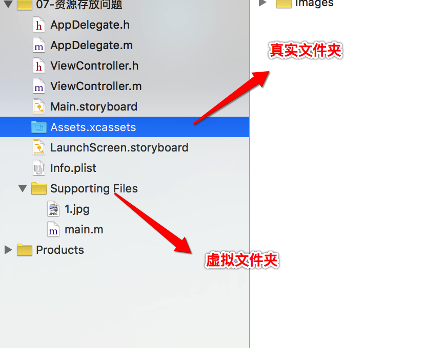

## 实现毛玻璃效果
- 做法:
        -往 UIImageView 中添加 UIToolbara 即可
- 示例代码:
```objc
    UIImageView *imageView = [[UIImageView alloc] init];
    imageView.frame = self.view.bounds;
    imageView.image = [UIImage imageNamed:@"1"];
    // 设置图片的内容模式
    imageView.contentMode = UIViewContentModeScaleAspectFill;

    // 1.5 设置毛玻璃
    UIToolbar *toolBar = [[UIToolbar alloc] init];
    toolBar.frame = imageView.bounds;
    // 1.6 设置工具栏的样式
    toolBar.barStyle = UIBarStyleBlack;
    // 1.7 设置透明度
    toolBar.alpha = 0.98;

    [imageView addSubview:toolBar];
```

<br />
##UILabel

- 常用属性
        显示的文字
        @property(nonatomic,copy)   NSString *text;

        字体
        @property(nonatomic,retain) UIFont  *font;

        文字颜色
        @property(nonatomic,retain) UIColor *textColor;

        对齐模式（比如左对齐、居中对齐、右对齐）
        @property(nonatomic) NSTextAlignment textAlignment;

        文字行数
        @property(nonatomic) NSInteger numberOfLines;

        换行模式
        @property(nonatomic) NSLineBreakMode lineBreakMode;

- 示例代码
```objc
    UILabel *label = [[UILabel alloc] init];
    label.frame = CGRectMake(50, 50, 200, 150);
    label.backgroundColor = [UIColor purpleColor];
    // 设置文字
    label.text = @"Hello World!Hello World!Hello World!Hello World!";
    // 设置对齐方式
    label.textAlignment = NSTextAlignmentCenter;
    // 设置文字的颜色
    label.textColor = [UIColor yellowColor];
    // 设置字体的大小
    label.font = [UIFont systemFontOfSize:20];
    label.font = [UIFont boldSystemFontOfSize:20];
    label.font = [UIFont italicSystemFontOfSize:20];
    // 设置行模式
    label.lineBreakMode = NSLineBreakByTruncatingMiddle;
    // 1.9 自动换行 ---> 0自动换行
    label.numberOfLines = 0;
    //  设置阴影
    label.shadowColor = [UIColor redColor];
    // 设置偏移量
    label.shadowOffset = CGSizeMake(-2, 2);
```

##UIImageView
- 常用属性
        显示的图片
        @property(nonatomic,retain) UIImage *image;

        显示的动画图片
        @property(nonatomic,copy) NSArray *animationImages;

        动画图片的持续时间
        @property(nonatomic) NSTimeInterval animationDuration;

        动画的播放次数（默认是0，代表无限播放
        @property(nonatomic) NSInteger animationRepeatCount;

        图片的内容模式
        @property(nonatomic) UIViewContentMode contentMode;

    - contentMode 内容模式的值有:
        - 带Scale单词: 表明图片有可能被拉伸或者压缩(变形)
    `UIViewContentModeScaleToFill`,<br>
    特点：
          将图片拉伸至填充整个imageView
   图片显示的尺寸跟imageView的尺寸是一样的

        - 带有Aspect单词: 会等比例缩放图片(不会变形)
    `UIViewContentModeScaleAspectFit`, <br> fit:自适应,特点：保证刚好能看到图片的全部
    `UIViewContentModeScaleAspectFill`, <br> fill:填充,特点：拉伸至图片的宽度或者高度跟imageView一样

        - 不带Scale单词: 表明图片不可能被拉伸或者压缩(变形)
    UIViewContentModeCenter,<br>
    UIViewContentModeTop,<br>
    UIViewContentModeBottom,<br>
    UIViewContentModeLeft,<br>
    UIViewContentModeRight,<br>
    UIViewContentModeTopLeft,<br>
    UIViewContentModeTopRight,<br>
    UIViewContentModeBottomLeft,<br>
    UIViewContentModeBottomRight<br>

    - 示例代码:
    ```objc
    UIImageView *imageView = [[UIImageView alloc] init];
    imageView.frame = CGRectMake(20, 50, 200, 150);
    imageView.backgroundColor = [UIColor redColor];
    imageView.image = [UIImage imageNamed:@"1"];
    // 设置图片的内容模式
    imageView.contentMode = UIViewContentModeScaleAspectFill;

    // 裁剪超出的内容
    imageView.clipsToBounds = YES;

    // 加入
    [self.view addSubview:imageView];
```


- 常用方法
        - (void)startAnimating; // 开始动画
        - (void)stopAnimating; // 停止动画
        - (BOOL)isAnimating; // 是否正在执行动画


##UIImage
- __资源存放问题__
    - 图片的__加载方式__:
        - 方式1:  `imageNamed:`
        - 方式2:  `imageWithContentsOfFile:`

    - 存放在`Assets.xcassets`:
        - 1.在资源包中对应的是Assets.car
        - 2.放到Assets.xcassets中的图片是无法获取到路径
        - 3.只能通过imageNamed:这种方式来加载图片
        - 4.不能通过imageWithContentsOfFile:这种方式来加载图片

    - 放到`项目目录`中:
        - 1.图片资源会被打包到MainBundle中
        - 2.能够获取到图片的路径
        - 3.能通过imageWithContentsOfFile:这种方式来加载图片
        - 4.也能通过imageNamed:这种方式来加载图片
- __内存分析__
    - `imageNamed:`
        - 加载图片,就算没有强指针指向,也不会从内存中被干掉 (默认带有缓存)
    - `imageWithContentFile:`
        - 加载图片,如果没有强指针指向,就会被从内存中被干掉 (默认不带有缓存)

    - `放到Assets.xcassets中的图片默认就带有缓存`

 - 使用场景:
    - imageNamed: 1)图片经常会被使用  2)少量的图片
    - imageWithContentFile: 1)图片不经常被使用  2)大批量的图片

##播放音效
- 头文件
        <AVFoundation/AVFoundation.h>
- 示例代码
```objc
// 1.2 创建播放器
    NSString *path = [[NSBundle mainBundle] pathForResource:@"mySong1.mp3" ofType:nil];
    NSURL *url = [NSURL fileURLWithPath:path];
    AVPlayerItem *playerItem = [[AVPlayerItem alloc] initWithURL:url];
    self.player = [[AVPlayer alloc] initWithPlayerItem:playerItem];

    // 1.3 播放
    [self.player play];
```

##资源拖放操作说明
- Copy items if needed:
        勾上,复制资源到项目;不勾,添加的只是资源的链接
- Create group
        若拖放的是一个文件夹,则会创建虚拟的文件夹,实际上使不存在的.默认,文件都是等级别的.文件夹颜色为黄色.
- Create folder references
        若拖放的是一个文件夹,则会创建真实的文件夹.文件夹颜色为蓝色.


