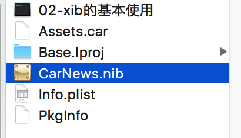

##自定义控件(UIView 作为父控件)
- 当外部调用`init`方法的时候,系统会默认调用`initWithFrame`:
        所以,当重写 init 方法后,又需要重写 initWithFrame 时,只需要重写 initWithFrame 即可


- `布局子控件`,即设置子控件的 `frame` 时,一般都写会写在- (void)`layoutSubviews;`上
        当往父控件的 frame 发生改变时,iOS会自动调用 layoutSubviews 方法


##xib 的使用
- 加载方式 <br />
<br />注意:加载后获取的是一个数组,则需要使用`firstObject` 或 `lastObject` 获取
    - 方式一
        ```objc
        UIView *carNewsView = [[[NSBundle mainBundle] loadNibNamed:@"CarNews" owner:nil options:nil] firstObject];
    carNewsView.center = CGPointMake(self.view.frame.size.width * 0.5, 100);
    [self.view addSubview:carNewsView];
```

    - 方式二
    ```objc
    UINib *nib = [UINib nibWithNibName:@"CarNews" bundle:nil];
    NSArray *views = [nib instantiateWithOwner:nil options:nil];
    UIView *carNewsView2 = [views firstObject];
     carNewsView2.center = CGPointMake(self.view.frame.size.width * 0.5, 250);
    [self.view addSubview:carNewsView2];
```
- xib 加载原理
        跟直接用代码生成自定义控件,其实是一样的.只不过,在 xib 中,我们已经布局好子控件,只需要传数据进去即可
例如:

```objc
# pragma mark - xib的加载原理
- (void)loadNib{
    XMGShopView *shopView = [[XMGShopView alloc] initWithCoder:nil];

    UIImageView *imageView = [[UIImageView alloc] initWithCoder:nil];
    imageView.tag = 1;
    imageView.backgroundColor = [UIColor greenColor];
    self.imageView = imageView;
    [shopView addSubview:imageView];

    // ...

}

```


- 问题:为什么方式二使用的是 nib,而不是 xib?<br />
查看应用程序的 Bundle<br />
<br />


<br />__xib 编译-运行后,变成了 nib!__

<br />
####方法

通过xib自定义控件, 一定会调用`initWithCoder:`和`awakeFromNib`

- -(void)`awakeFromNib`;
        当xib中的控件加载完毕的时候调用
        作用: 设置子控件的属性   添加子控件
例子:重写 awakeFromNib 方法

```objc
- (void)awakeFromNib{
    [super awakeFromNib];

    // 添加子控件
    UIToolbar *toolBar = [[UIToolbar alloc] init];
    self.toolBar = toolBar;
    [self.imageView addSubview:toolBar];
}

```

- -(instancetype)`initWithCoder`:(NSCoder *)aDecoder;
        xib 初始化的时候,就会自动调用这个方法(不常用)

##执行动画
例子：
```objc
[UIView animateWithDuration:0.5 delay:1.0 options:UIViewAnimationOptionCurveLinear animations:^{
        //执行动画
        CGRect tempFrame = self.redView.frame;
        tempFrame.origin.y += 100;
        self.redView.frame = tempFrame;

    } completion:^(BOOL finished) {
        self.redView.backgroundColor = [UIColor yellowColor];
    }];
```
- 参数说明：
    - `UIViewAnimationOptionCurveEaseInOut`
            开始和结束比较慢,中间比较快
    - `UIViewAnimationOptionCurveEaseIn`
            开场比较慢,后面比较快
    - `UIViewAnimationOptionCurveEaseOut`
            开场正常,结尾比较慢
    - `UIViewAnimationOptionCurveLinear`
            线性----> 匀速

##UIButton
####自定义UIButton

若要改变按钮上tiitle和image默认位置，需要重写：
- `titleRectForContentRect`
- `imageRectForContentRect`
<br />或
- `layoutSubviews`

<br />
若还需要进行其他的操作时，可以在initWithFrame上进行
<br />例子：
```objc
// 设置对其方式
- (instancetype)initWithFrame:(CGRect)frame{
    if (self = [super initWithFrame:frame]) {
        self.titleLabel.textAlignment = NSTextAlignmentCenter;
        self.imageView.contentMode = UIViewContentModeScaleAspectFit;
    }
    return self;
}


// 方式1:
// 重写两个方法
/*
- (CGRect)titleRectForContentRect:(CGRect)contentRect{
   return  CGRectMake(0, 0, 100, 60);
}

- (CGRect)imageRectForContentRect:(CGRect)contentRect{
   return CGRectMake(100, 0, 50, 60);
}
 */

// 方式2:
// 重新布局子控件
- (void)layoutSubviews{
    [super layoutSubviews];
    // 设置按钮的子控件的frame
    self.titleLabel.frame = CGRectMake(0, 0, 100, 60);
    self.imageView.frame = CGRectMake(100, 0, 50, 60);
}
```

####UIButton内边距属性
- contentEdgeInsets
        内容内边距
- imageEdgeInsets
        图片内边距

```objc
- (void)viewDidLoad {
    [super viewDidLoad];
//    self.button.contentEdgeInsets = UIEdgeInsetsMake(10, 5, 0, 0);
//    self.button.imageEdgeInsets = UIEdgeInsetsMake(5, 16, 0, 0);
    self.button.titleEdgeInsets = UIEdgeInsetsMake(10, 5, 0, 0);
}
```

##图片拉伸
防止图片拉伸时，发生变形，使用以下方法对图片进行处理：<br />
想法：<br />
__抠出一个小方块出来进行拉伸,使得图片的其他四角不会发生改变__
- `resizableImageWithCapInsets`
```objc
UIImage *image = [UIImage imageNamed:@"chat_send_nor"];
    // 作用: 根据传入需要保护的区域返回一张受保护的图片
    // 抠出一个小方块出来进行拉伸,使得图片的其他四角不会发生改变
    UIEdgeInsets edgeInsets = UIEdgeInsetsMake(image.size.height * 0.5, image.size.width * 0.5, image.size.height * 0.5 -1, image.size.width * 0.5 -1);
    /*
     UIImage *protectImage = [image resizableImageWithCapInsets:edgeInsets];
     */
    /*
     UIImageResizingModeTile,  以平铺的方式进行拉伸,即用小方块一个一个平铺所有的空白
     UIImageResizingModeStretch, 直接拉伸平铺,即直接拉伸小方块
     */
    UIImage *protectImage = [image resizableImageWithCapInsets:edgeInsets resizingMode:UIImageResizingModeTile];
    self.imageView.image = protectImage;
```

- `stretchableImageWithLeftCapWidth`(其实是调用了上面的方法)
```objc
UIImage *image = [UIImage imageNamed:@"chat_send_nor"];
    // 这个方法，其实是调用了resizableImageWithCapInsets，自动帮我们做了以下的操作：
    // rightCapWidth = width - leftCapWidth - 1
    // bottomCapWidth = height - topCapWidth - 1
    UIImage *protectImage = [image stretchableImageWithLeftCapWidth:image.size.width * 0.5 topCapHeight:image.size.height *0.5];
    self.imageView.image = protectImage;
```

可把这个方法放到写到UIImage的类拓展里面：
```objc
#import <UIKit/UIKit.h>

@interface UIImage (XMGExtention)
/**
 *  返回一张受保护的图片,使得图片拉伸或压缩不变形
 *
 *  @param imageName 图片的名称
 *
 *  @return 受保护的图片
 */
+ (instancetype)resizableImageWithImageName:(NSString *)imageName;
@end
```

```objc
#import "UIImage+XMGExtention.h"

@implementation UIImage (XMGExtention)
+(instancetype)resizableImageWithImageName:(NSString *)imageName{
   // 创建图片对象
    UIImage *image = [UIImage imageNamed:imageName];
    // 图片的尺寸
    CGFloat imageWidth = image.size.width * 0.5;
    CGFloat imageHeight = image.size.height * 0.5;
    return [image stretchableImageWithLeftCapWidth:imageWidth topCapHeight:imageHeight];
}
@end
```


