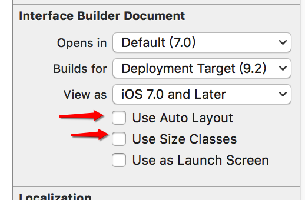
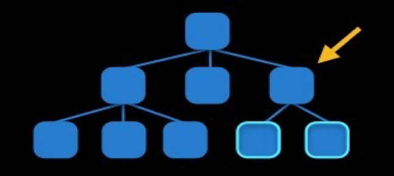
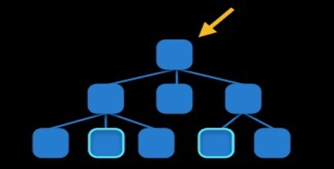
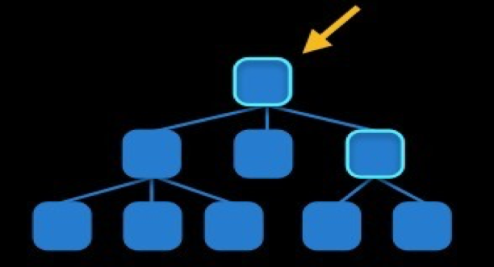
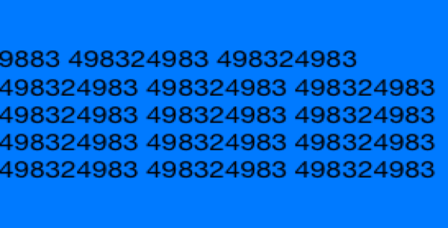
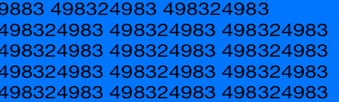
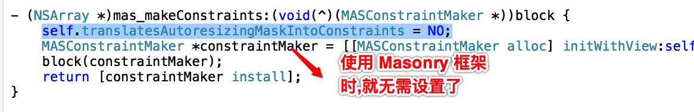

##获取屏幕宽度
以前为了适配屏幕宽度,可能会这样处理:
```objc
#define ScreenW [UIScreen mainScreen].bounds.size.width
#define ScreenH [UIScreen mainScreen].bounds.size.height
// 创建一个显示在屏幕右下角的按钮
CGFloat buttonW = 100;
CGFloat buttonH = 50;
button.frame = CGRectMake(ScreenW - buttonW, ScreenH - buttonH, buttonW, buttonH);

```


##Autoresizing
- 与 Autolayout 对比:
    - Autoresizing仅仅能解决子控件和父控件之间的相对关系问题
    - Autolayout解决任何控件之间的相对关系问题

- 使用前,需要将 Auto Layout 设置为 no


- `autoresizingMask`:设置自动调整
    - UIViewAutoresizingFlexible`LeftMargin`
        - 距离父控件的左边是可以伸缩的
    - UIViewAutoresizingFlexible`BottomMargin`
        - 距离父控件的底部是可以伸缩的
    - UIViewAutoresizingFlexible`RightMargin`
        - 距离父控件的右边是可以伸缩的
    - UIViewAutoresizingFlexible`TopMargin`
        - 距离父控件的顶部是可以伸缩的<hr />
    - UIViewAutoresizingFlexible`Height`
        - 高度跟随父控件的高度进行伸缩
    - UIViewAutoresizingFlexible`Width`
        - 宽度跟随父控件的宽度进行伸缩

例子:
```objc
    UIView *redView = [[UIView alloc] init];
    redView.backgroundColor = [UIColor redColor];
    CGFloat redViewX = self.view.frame.size.width - 100;
    CGFloat redViewY = self.view.frame.size.height - 100;
    redView.frame = CGRectMake(redViewX, redViewY, 100, 100);
    redView.autoresizingMask = UIVeiewAutoresizingFlexibleLeftMargin |
                            UIViewAutoresizingFlexibleTopMargin |
                            UIViewAutoresizingFlexibleWidth;

```

##Autolayout
- __核心概念__
    - `约束`:通过给控件添加约束,来决定控件的位置和尺寸
    - `参照`:在添加约束时,是依照谁来添加(可以是父控件或者兄弟控件)

- 代码实现 Autolayout 时的__注意点__:
    - 要先禁止autoresizing功能，设置view的下面属性为NO

    ```objc
    view.translatesAutoresizingMaskIntoConstraints = NO;

    ```
    - 不用再给view设置frame

- Autolayout 的核心__计算公式__:
        obj1.property1 =（obj2.property2 * multiplier）+ constant value

<br /><br />注意:<br />
优先级默认是1000.<br />
案例:通过 Autolayout 实现动画时候,如果删除中间的那个,第3个向第1个靠拢,则需要设置第3个和第1个的间距,并调小优先级


- __仅作了解__
    - `添加约束的规则`
        - 对于两个同层级view之间的约束关系，添加到它们的父view上
         

        - 对于两个不同层级view之间的约束关系，添加到他们最近的共同父view上
        
        - 对于有层次关系的两个view之间的约束关系，添加到层次较高的父view上
        

    - `VFL`
        - Visual Format Language, 可视化格式语言
        - VFL是苹果公司为了简化Autolayout的编码而推出的抽象语言

- `有了 Autolayout 的 UILabel`
    - 在没有Autolayout之前，UILabel的文字内容总是居中显示，导致顶部和底部会有一大片空缺区A域
    
    - 有Autolayout之后，UILabel的bounds默认会自动包住所有的文字内容，顶部和底部不再会有空缺区域
    - 

- __基于Autolayout的动画__
    - 在修改了约束之后，只要执行下面代码，就能做动画效果(`约束实质是一个对象,连线后可进行修改`)
            [UIView animateWithDuration:1.0 animations:^{
                [添加了约束的view的父控件 layoutIfNeeded];
            }];
例子:

    ```objc
        - (void)touchesBegan:(NSSet<UITouch *> *)touches withEvent:(UIEvent *)event
        {
            // 修改约束(连线后获取)
            self.redViewWLc.constant = 50;

            [UIView animateWithDuration:2.0 animations:^{
                // 强制刷新
                [self.view layoutIfNeeded];
            }];
        }
    ```

##Masonry 框架
目前最流行的Autolayout第三方框架
- 无需禁止autoresizing功能,因为它已经帮我们做好了


- 使用的时候,一般都要引入宏:

    ```objc
    //define this constant if you want to use Masonry without the 'mas_' prefix
    #define MAS_SHORTHAND

    //define this constant if you want to enable auto-boxing for default syntax
    #define MAS_SHORTHAND_GLOBALS
```
查找位置:Examples/Masonry\ iOS\ Examples/Masonry\ iOS\ Examples-Prefix.pch

说明:<br />
    - __#define MAS_SHORTHAND__<br />
            默认,使用属性时,都需要加上mas_属性,比如:mas_width,引入#define MAS_SHORTHAND宏之后, 可以简写为: width

    - __#define MAS_SHORTHAND_GLOBALS__<br />
        - 默认情况下
            - mas_equalTo有自动包装功能，比如自动将20包装
            为@20
            - equalTo没有自动包装功能
        - 添加了#define MAS_SHORTHAND_GLOBALS 宏之后,mas_equalTo和equalTo就没有区别了

__注意__:
___`要使用宏使,必须在引入#import "Masonry.h"之前添加`___

- 可有可无的用法:只是为了提供阅读性

    ```objc
    - (MASConstraint *)with {
        return self;
    }

    - (MASConstraint *)and {
        return self;
    }

    ```

