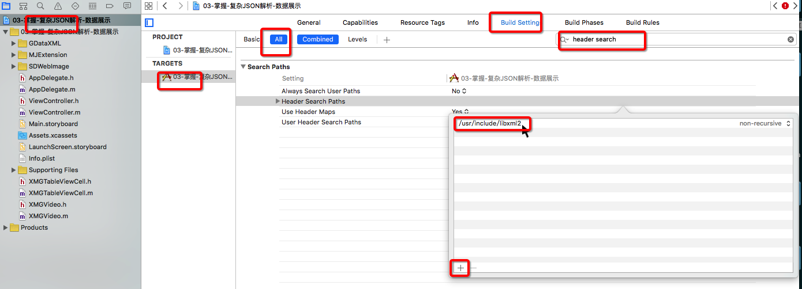
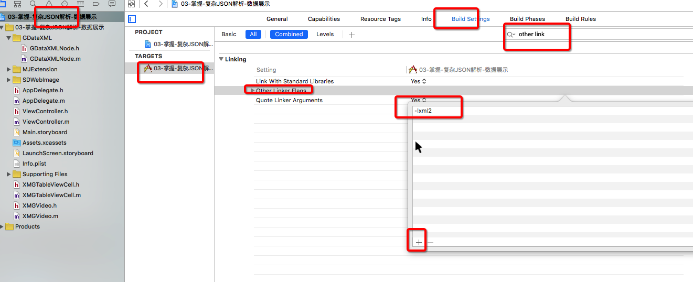
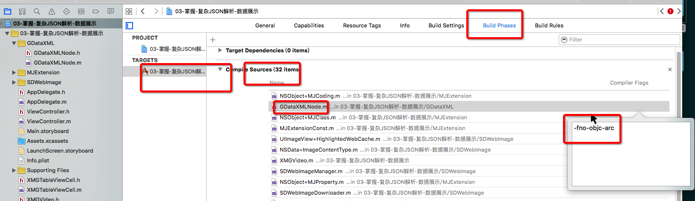

# GDataXML解析XML(Google 提供)
##1. 使用问题
- 需要导入:
    - GDataXML
- 一般配置






## 2. 基本使用
- 1.导入头文件
```objc
#import "GDataXMLNode.h"
```
- 2.加载整个 XML 文档
```objc
GDataXMLDocument *doc = [[GDataXMLDocument alloc] initWithData:data options:kNilOptions error:nil];
```

- 3.拿到根元素,得到根元素内部所有名称为video的属性
```objc
NSArray *eles = [doc.rootElement elementsForName:@"video"];
```

- 4.遍历所有的子元素,得到元素内部的属性数据
```objc
[eles enumerateObjectsUsingBlock:^(GDataXMLElement *element, NSUInteger index, BOOL * _Nonnull stop) {

            Video *video = [[Video alloc] init];

            video.name = [element attributeForName:@"name"].stringValue;
            video.image = [element attributeForName:@"image"].stringValue;
            video.ID = [element attributeForName:@"id"].stringValue;
            video.length = [element attributeForName:@"length"].stringValue;
            video.url = [element attributeForName:@"url"].stringValue;

            [self.videos addObject:video];
        }];
```

示例XML 结构

