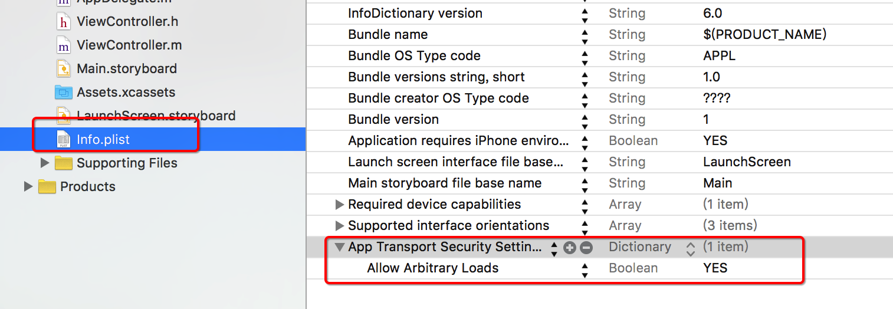

# HTTPS请求

####设置 info.plist


####1. AFN
```objc
-(void)afn
{
    AFHTTPSessionManager *manager = [AFHTTPSessionManager manager];

    manager.responseSerializer = [AFHTTPResponseSerializer serializer];

    AFSecurityPolicy *policy = [AFSecurityPolicy policyWithPinningMode:AFSSLPinningModeNone];
    policy.allowInvalidCertificates = YES;//接收无效的证书,默认是NO
    policy.validatesDomainName = NO;    //不验证域名
    manager.securityPolicy = policy;

    [manager GET:@"https://kyfw.12306.cn/otn" parameters:nil progress:nil success:^(NSURLSessionDataTask * _Nonnull task, id  _Nullable responseObject) {
        NSLog(@"--%@---",[[NSString alloc]initWithData:responseObject encoding:NSUTF8StringEncoding]);
    } failure:^(NSURLSessionDataTask * _Nullable task, NSError * _Nonnull error) {
        NSLog(@"失败--%@---",error);
    }];
}
```

####2. Session
```objc
-(void)session
{
    //1.确定URL
    NSURL *url = [NSURL URLWithString:@"https://kyfw.12306.cn/otn"];

    //2.创建可变的请求对象
    NSMutableURLRequest *request = [NSMutableURLRequest requestWithURL:url];
    NSURLSession *session= [NSURLSession sessionWithConfiguration:[NSURLSessionConfiguration defaultSessionConfiguration] delegate:self delegateQueue:[NSOperationQueue mainQueue]];

    [[session dataTaskWithRequest:request completionHandler:^(NSData * _Nullable data, NSURLResponse * _Nullable response, NSError * _Nullable error) {

        NSLog(@"%@",[[NSString alloc]initWithData:data encoding:NSUTF8StringEncoding]);
    }] resume];
}
#pragma mark --------------------
#pragma mark NSURLSessionDataDelegate

//NSURLAuthenticationMethodServerTrust 服务器信任
//当发送一个https请求的时候回调用,在该方法中安装证书信任服务
//challenge 质询(挑战--证书)
-(void)URLSession:(NSURLSession *)session task:(NSURLSessionTask *)task didReceiveChallenge:(NSURLAuthenticationChallenge *)challenge completionHandler:(void (^)(NSURLSessionAuthChallengeDisposition, NSURLCredential * _Nullable))completionHandler
{
    NSLog(@"%@",challenge.protectionSpace);

    if (![challenge.protectionSpace.authenticationMethod isEqualToString:@"NSURLAuthenticationMethodServerTrust"]) {
        return;
    }

    NSURLCredential *credential = [[NSURLCredential alloc]initWithTrust:challenge.protectionSpace.serverTrust];
    /*
     NSURLSessionAuthChallengeUseCredential = 0,   使用该证书
     NSURLSessionAuthChallengePerformDefaultHandling = 1, 默认会忽略
     NSURLSessionAuthChallengeCancelAuthenticationChallenge = 2, 取消本次请求忽略证书
     NSURLSessionAuthChallengeRejectProtectionSpace = 3, 拒绝
     */
    completionHandler(NSURLSessionAuthChallengeUseCredential,credential);

}
```
