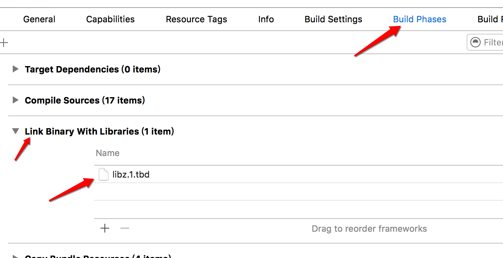

# 文件的压缩和解压缩

#### 说明
使用`SSZipArchive`第三方框架

导入后一般会报错, 需要引入:


#### 压缩

- 压缩文件

```objc
// 压缩文件
- (void) zip1{

    NSArray *fileArr = @[
                         @"/Users/apple/Desktop/300-2.jpeg",
                         @"/Users/apple/Desktop/300.jpeg",
                         ];

    /*
     第一个参数:压缩包存放的位置
     第二个参数:要压缩的所有文件的路径
     */
    [SSZipArchive createZipFileAtPath:@"/Users/apple/Desktop/keen.zip" withFilesAtPaths:fileArr];
}

```

- 压缩文件夹

```objc
// 压缩文件夹
- (void) zip2{

    [SSZipArchive createZipFileAtPath:@"/Users/apple/Desktop/keen.zip" withContentsOfDirectory:@"/Users/apple/Desktop/keen"];
}
```

#### 解压
```objc
// 解压
- (void) unzip{

    [SSZipArchive unzipFileAtPath:@"/Users/apple/Desktop/keen.zip" toDestination:@"/Users/apple/Desktop/keen2"];
}
```
