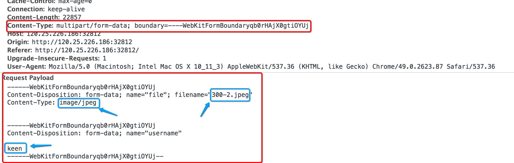

# NSURLSession实现文件上传

## 知识点
####1.一般过程
```objc
// 1.确定 URL
    NSURL *url = [NSURL URLWithString:@"http://120.25.226.186:32812/upload"];

    // 2.创建可变的请求对象
    NSMutableURLRequest *request = [NSMutableURLRequest requestWithURL:url];

    // 3.修改请求方式
    request.HTTPMethod = @"POST";

    // 4.设置请求头信息
    NSString *header = [NSString stringWithFormat:@"multipart/form-data; boundary=%@", kboundary];
    [request setValue:header forHTTPHeaderField:@"Content-Type"];

    // 5.创建 session
    NSURLSession *session = [NSURLSession sessionWithConfiguration:[NSURLSessionConfiguration defaultSessionConfiguration] delegate:self delegateQueue:[NSOperationQueue mainQueue]];

    // 6.创建 task
    /*
     第一个参数:请求对象
     第二个参数:要上传的数据
     */
    NSURLSessionUploadTask *uploadTask = [session uploadTaskWithRequest:request fromData:[self getRequestBody] completionHandler:^(NSData * _Nullable data, NSURLResponse * _Nullable response, NSError * _Nullable error) {

        // 8.解析服务器返回的响应信息
        NSLog(@"%@", [[NSString alloc] initWithData:data encoding:NSUTF8StringEncoding]);
    }];

    // 7.执行 task
    [uploadTask resume];
```
####2.拼接请求体信息(格式固定, 只需要更改几个参数即可)
`这些信息是与网页上的一致的:`

`根据上传文件类型的不同, 需要进行更改就只有3个蓝色框`

```objc
// 设置请求体的信息
- (NSData *)getRequestBody{

    // 1.拼接数据
    NSMutableData *uploadData = [NSMutableData data];

    ///5.1 拼接文件参数
    // 格式:
    /*
     --分隔符
     Content-Disposition: form-data; name="file"; filename="Snip20200808_9.png"
     Content-Type: image/png
     空行
     文件参数
     */
    // 说明:
    /*
     name="file": 参数名称(是固定的,由当前的服务器规定的), 不用更改
     filename="Snip20200808_9.png": 设置文件在服务器上面以什么名称保存 (需要更改)
     Content-Type: image/png :文件类型 (需要更改)
     */
    [uploadData appendData:[[NSString stringWithFormat:@"--%@",kboundary] dataUsingEncoding:NSUTF8StringEncoding]];
    [uploadData appendData:KNewLine];
    [uploadData appendData:[@"Content-Disposition: form-data; name=\"file\"; filename=\"123.jpeg\"" dataUsingEncoding:NSUTF8StringEncoding]];
    [uploadData appendData:KNewLine];
    [uploadData appendData:[@"Content-Type: image/jpeg" dataUsingEncoding:NSUTF8StringEncoding]];
    [uploadData appendData:KNewLine];
    [uploadData appendData:KNewLine];

    // 数据 (需要更改)
    UIImage *image = [UIImage imageNamed:@"300-2.jpeg"];
    NSData *imageData = UIImagePNGRepresentation(image);
    [uploadData appendData:imageData];

    [uploadData appendData:KNewLine];

    //5.2 拼接非文件参数
    // 格式:
    /*
     --分隔符
     Content-Disposition: form-data; name="username"
     空行
     用户名
     */
    // 说明:
    /*
     name="username": 不用更改
     用户名 :修改成用户名
     */
    [uploadData appendData:[[NSString stringWithFormat:@"--%@",kboundary] dataUsingEncoding:NSUTF8StringEncoding]];
    [uploadData appendData:KNewLine];
    [uploadData appendData:[@"Content-Disposition: form-data; name=\"username\"" dataUsingEncoding:NSUTF8StringEncoding]];
    [uploadData appendData:KNewLine];
    [uploadData appendData:KNewLine];
    [uploadData appendData:[@"xiaomage" dataUsingEncoding:NSUTF8StringEncoding]];
    [uploadData appendData:KNewLine];

    //5.3 拼接结尾标识
    // --分隔符--
    [uploadData appendData:[[NSString stringWithFormat:@"--%@--",kboundary] dataUsingEncoding:NSUTF8StringEncoding]];
    return uploadData;
}
```

####3.常用代理方法
```objc
//bytesSent 表示本次上传文件数据的大小
//totalBytesSent 已经上传的文件大小
//totalBytesExpectedToSend:文件的总大小
- (void)URLSession:(NSURLSession *)session task:(NSURLSessionTask *)task didSendBodyData:(int64_t)bytesSent totalBytesSent:(int64_t)totalBytesSent totalBytesExpectedToSend:(int64_t)totalBytesExpectedToSend{

    NSLog(@"上传进度: %lf", 1.0 * totalBytesSent / totalBytesExpectedToSend);
}
```

##完整代码
```objc
//分隔符,可以随便写(不能有中文和特殊字符)
#define kboundary @"----WebKitFormBoundaryTXB9yxAAArxFVoHf"
#define KNewLine [@"\r\n" dataUsingEncoding:NSUTF8StringEncoding]

#import "ViewController.h"

@interface ViewController ()<NSURLSessionDataDelegate>

@end

@implementation ViewController

- (void)touchesBegan:(NSSet<UITouch *> *)touches withEvent:(UIEvent *)event{

    [self upload];
}


- (void) upload{

    // 1.确定 URL
    NSURL *url = [NSURL URLWithString:@"http://120.25.226.186:32812/upload"];

    // 2.创建可变的请求对象
    NSMutableURLRequest *request = [NSMutableURLRequest requestWithURL:url];

    // 3.修改请求方式
    request.HTTPMethod = @"POST";

    // 4.设置请求头信息
    NSString *header = [NSString stringWithFormat:@"multipart/form-data; boundary=%@", kboundary];
    [request setValue:header forHTTPHeaderField:@"Content-Type"];

    // 5.创建 session
    NSURLSession *session = [NSURLSession sessionWithConfiguration:[NSURLSessionConfiguration defaultSessionConfiguration] delegate:self delegateQueue:[NSOperationQueue mainQueue]];

    // 6.创建 task
    /*
     第一个参数:请求对象
     第二个参数:要上传的数据
     */
    NSURLSessionUploadTask *uploadTask = [session uploadTaskWithRequest:request fromData:[self getRequestBody] completionHandler:^(NSData * _Nullable data, NSURLResponse * _Nullable response, NSError * _Nullable error) {

        // 8.解析服务器返回的响应信息
        NSLog(@"%@", [[NSString alloc] initWithData:data encoding:NSUTF8StringEncoding]);
    }];

    // 7.执行 task
    [uploadTask resume];
}

// 设置请求体的信息
- (NSData *)getRequestBody{

    // 1.拼接数据
    NSMutableData *uploadData = [NSMutableData data];

    ///5.1 拼接文件参数
    // 格式:
    /*
     --分隔符
     Content-Disposition: form-data; name="file"; filename="Snip20200808_9.png"
     Content-Type: image/png
     空行
     文件参数
     */
    // 说明:
    /*
     name="file": 参数名称(是固定的,由当前的服务器规定的), 不用更改
     filename="Snip20200808_9.png": 设置文件在服务器上面以什么名称保存 (需要更改)
     Content-Type: image/png :文件类型 (需要更改)
     */
    [uploadData appendData:[[NSString stringWithFormat:@"--%@",kboundary] dataUsingEncoding:NSUTF8StringEncoding]];
    [uploadData appendData:KNewLine];
    [uploadData appendData:[@"Content-Disposition: form-data; name=\"file\"; filename=\"123.jpeg\"" dataUsingEncoding:NSUTF8StringEncoding]];
    [uploadData appendData:KNewLine];
    [uploadData appendData:[@"Content-Type: image/jpeg" dataUsingEncoding:NSUTF8StringEncoding]];
    [uploadData appendData:KNewLine];
    [uploadData appendData:KNewLine];

    // 数据 (需要更改)
    UIImage *image = [UIImage imageNamed:@"300-2.jpeg"];
    NSData *imageData = UIImagePNGRepresentation(image);
    [uploadData appendData:imageData];

    [uploadData appendData:KNewLine];

    //5.2 拼接非文件参数
    // 格式:
    /*
     --分隔符
     Content-Disposition: form-data; name="username"
     空行
     用户名
     */
    // 说明:
    /*
     name="username": 不用更改
     用户名 :修改成用户名
     */
    [uploadData appendData:[[NSString stringWithFormat:@"--%@",kboundary] dataUsingEncoding:NSUTF8StringEncoding]];
    [uploadData appendData:KNewLine];
    [uploadData appendData:[@"Content-Disposition: form-data; name=\"username\"" dataUsingEncoding:NSUTF8StringEncoding]];
    [uploadData appendData:KNewLine];
    [uploadData appendData:KNewLine];
    [uploadData appendData:[@"xiaomage" dataUsingEncoding:NSUTF8StringEncoding]];
    [uploadData appendData:KNewLine];

    //5.3 拼接结尾标识
    // --分隔符--
    [uploadData appendData:[[NSString stringWithFormat:@"--%@--",kboundary] dataUsingEncoding:NSUTF8StringEncoding]];
    return uploadData;
}

#pragma mark --------------------------
#pragma mark NSURLSessionDataDelegate
//bytesSent 表示本次上传文件数据的大小
//totalBytesSent 已经上传的文件大小
//totalBytesExpectedToSend:文件的总大小
- (void)URLSession:(NSURLSession *)session task:(NSURLSessionTask *)task didSendBodyData:(int64_t)bytesSent totalBytesSent:(int64_t)totalBytesSent totalBytesExpectedToSend:(int64_t)totalBytesExpectedToSend{

    NSLog(@"上传进度: %lf", 1.0 * totalBytesSent / totalBytesExpectedToSend);
}


@end
```
