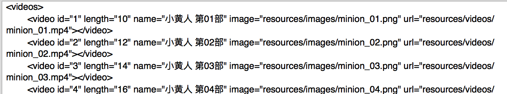

# NSXMLParser解析XML(苹果原生)

## 一般步骤
- 1.创建 xml 解析器
```objc
NSXMLParser *parser = [[NSXMLParser alloc] initWithData:data];
```
- 2.设置代理, 需遵循 NSXMLParserDelegate 协议
```objc
parser.delegate = self;
```

- 3.开始解析(方法本身是阻塞的, 即没有完成的话, 是不会进行下一步的)
```objc
[parser parse];
```

- 4.重写常用代理方法

```objc
// 1.开始解析XML文档
- (void)parserDidStartDocument:(NSXMLParser *)parser{

    NSLog(@"%s --- 开始解析 XML 文档", __func__);
}

// 2.开始解析某个元素
- (void)parser:(NSXMLParser *)parser didStartElement:(NSString *)elementName namespaceURI:(NSString *)namespaceURI qualifiedName:(NSString *)qName attributes:(NSDictionary<NSString *,NSString *> *)attributeDict{

    NSLog(@"%s --- 开始解析某个元素 -- elementName = %@, attributeDict = %@", __func__, elementName, attributeDict);

    if ([elementName isEqualToString:@"videos"]) {

        // 过滤根元素
        return;
    }

    [self.videos addObject:[Video mj_objectWithKeyValues:attributeDict]];

//    Video *video = [[Video alloc] init];
//    [video mj_setKeyValues:attributeDict];
//    [self.videos addObject:video];
}

```

示例XML 结构


