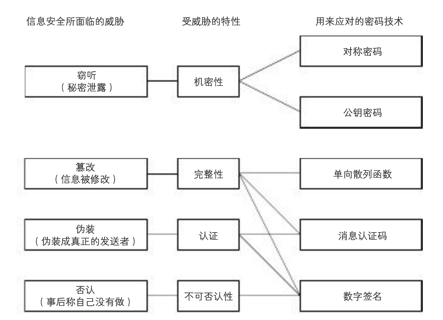
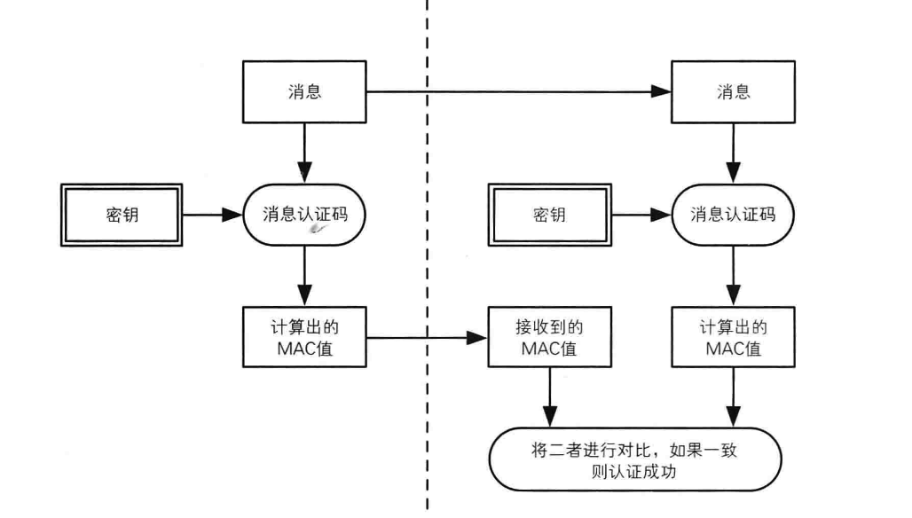
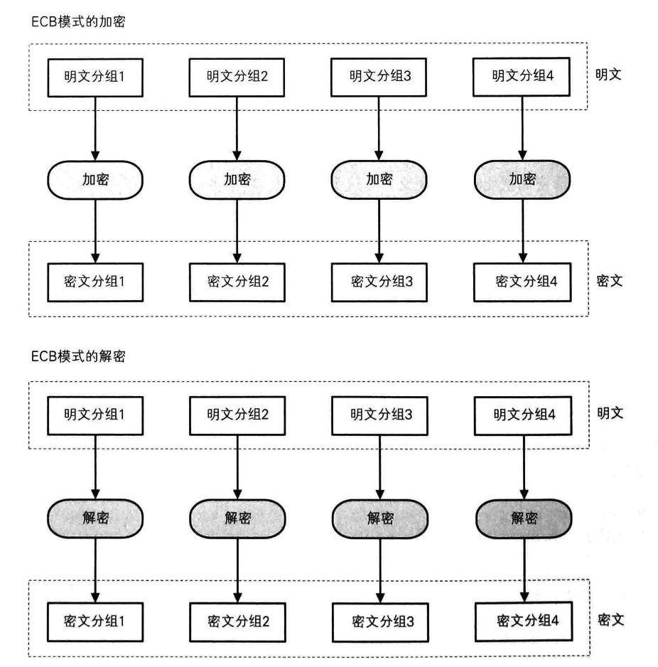
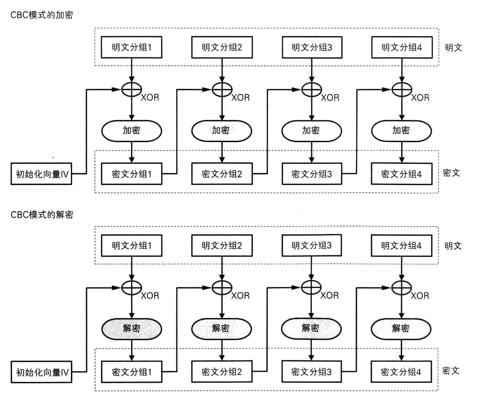
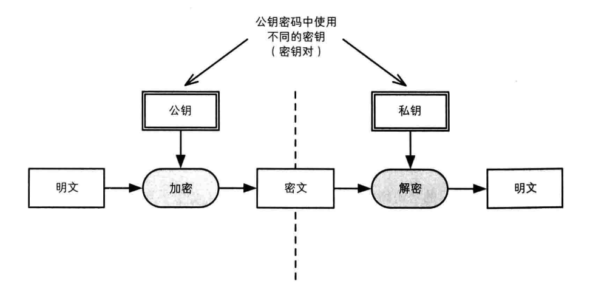
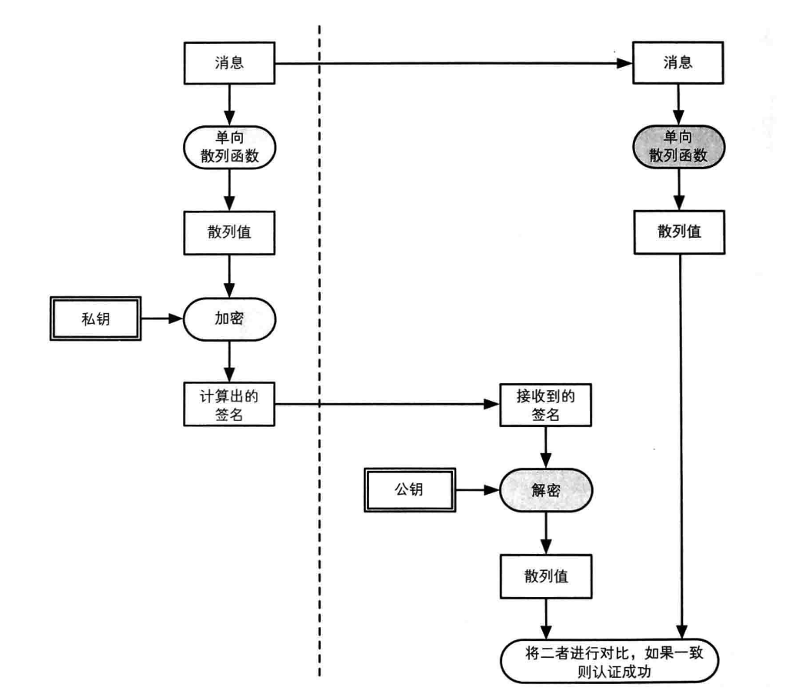

# Security安全性
###1.数据安全
```objc
01 攻城利器：Charles（公司中一般都使用该工具来抓包，并做网络测试）
注意：Charles在使用中的乱码问题，可以显示包内容，然后打开info.plist文件，找到java目录下面的VMOptions，在后面添加一项：-Dfile.encoding=UTF-8
02 数据安全的原则
    1）在网络上"不允许"传输用户隐私数据的"明文"
    2.）在本地"不允许"保存用户隐私数据的"明文"
03 数据加密的方式和规范一般公司会有具体的规定，不必多花时间。
```

###2.Base64
```objc
1.Base64简单说明
    描述：Base64可以成为密码学的基石，非常重要。
    特点：可以将任意的二进制数据进行Base64编码
    结果：所有的数据都能被编码为并只用65个字符就能表示的文本文件。
    65字符：A~Z a~z 0~9 + / =
    对文件进行base64编码后文件数据的变化：编码后的数据~=编码前数据的4/3，会大1/3左右。

2.命令行进行Base64编码和解码
    编码：base64 123.png -o 123.txt
    解码：base64 123.txt -o test.png -D

2.Base64编码原理
    1)将所有字符转化为ASCII码；
    2)将ASCII码转化为8位二进制；
    3)将二进制3个归成一组(不足3个在后边补0)共24位，再拆分成4组，每组6位；
    4)统一在6位二进制前补两个0凑足8位；
    5)将补0后的二进制转为十进制；
    6)从Base64编码表获取十进制对应的Base64编码；

处理过程说明：
    a.转换的时候，将三个byte的数据，先后放入一个24bit的缓冲区中，先来的byte占高位。
    b.数据不足3byte的话，于缓冲区中剩下的bit用0补足。然后，每次取出6个bit，按照其值选择查表选择对应的字符作为编码后的输出。
    c.不断进行，直到全部输入数据转换完成。
    d.如果最后剩下两个输入数据，在编码结果后加1个“=”；
    e.如果最后剩下一个输入数据，编码结果后加2个“=”；
    f.如果没有剩下任何数据，就什么都不要加，这样才可以保证资料还原的正确性。

3.实现
    a.说明：
        1）从iOS7.0 开始，苹果就提供了base64的编码和解码支持
        2)如果是老项目，则还能看到base64编码和解码的第三方框架，如果当前不再支持iOS7.0以下版本，则建议替换。

    b.相关代码：
    //给定一个字符串，对该字符串进行Base64编码，然后返回编码后的结果
    -(NSString *)base64EncodeString:(NSString *)string
    {
        //1.先把字符串转换为二进制数据
        NSData *data = [string dataUsingEncoding:NSUTF8StringEncoding];

        //2.对二进制数据进行base64编码，返回编码后的字符串
        return [data base64EncodedStringWithOptions:0];
    }

    //对base64编码后的字符串进行解码
    -(NSString *)base64DecodeString:(NSString *)string
    {
        //1.将base64编码后的字符串『解码』为二进制数据
        NSData *data = [[NSData alloc]initWithBase64EncodedString:string options:0];

        //2.把二进制数据转换为字符串返回
        return [[NSString alloc]initWithData:data encoding:NSUTF8StringEncoding];
    }

    c.终端测试命令
        $ echo -n A | base64
        $ echo -n QQ== |base64 -D
```

###3.常见的加密算法和其它
```objc
1. base64 编码格式
2. 密码学演化 "秘密本"-->RSA
3. 常见的加密算法
    1）消息摘要（单向散列函数）
    2）对称加密
    3）非对称加密
    4）证书等
```
###4.单向散列函数
```objc
1.单向散列函数的特点：
    ①加密后密文的长度是定长的
    ②如果明文不一样，那么散列后的结果一定不一样
    ③如果明文一样，那么加密后的密文一定一样（对相同数据加密，加密后的密文一样）
    ④所有的加密算法是公开的
    ⑤不可以逆推反算
2.经典加密算法
    1）MD5加密
    2）SHA1
    3）SHA512
3.MD5加密算法简单说明
    1）对字符串进行MD5加密可以得到一个32个字符的密文
    2）加密之后不能根据密文逆推出明文
    3）MD5已经被破解（暴力破解|碰撞检测）
4.MD5加密进阶
    1）先加盐，然后再进行MD5
    2）先乱序，再进行MD5加密
    3）乱序|加盐，多次MD5加密等
    4）使用消息认证机制，即HMAC-MD5-先对密钥进行加密，加密之后进行两次MD5散列
    5）加密命令行
        MD5加密-字符串    $ echo -n "520it" |md5
        MD5加密-文件1     $ md5 abc.png
        SHA1加密：        $ echo -n "520it" |openssl sha -sha1
        SHA256            $ echo -n "520it" |openssl sha -sha256
        SHA512            $ echo -n "520it" |openssl sha -sha512
        hmacMD5加密       $ echo -n "520it" |openssl dgst -md5 -hmac "123"

5.散列函数应用领域
    1）搜索 多个关键字，先对每个关键字进行散列，然后多个关键字进行或运算，如果值一致则搜索结果一致
    2）版权 对文件进行散列判断该文件是否是正版或原版的
    3）文件完整性验证 对整个文件进行散列，比较散列值判断文件是否完整或被篡改
6.消息认证机制（HMAC）简单说明
    1）原理
        ①消息的发送者和接收者有一个共享密钥
        ②发送者使用共享密钥对消息加密计算得到MAC值（消息认证码）
        ③消息接收者使用共享密钥对消息加密计算得到MAC值
        ④比较两个MAC值是否一致
    2）使用
        ①客户端需要在发送的时候把（消息）+（消息·HMAC）一起发送给服务器
        ②服务器接收到数据后，对拿到的消息用共享的KEY进行HMAC，比较是否一致，如果一致则信任
```



###5.对称加密
```objc
1.对称加密的特点
    1）加密/解密使用相同的密钥
    2）加密和解密的过程是可逆的（明文-》明文-》明文）
```

```objc
2.经典算法
    1）DES 数据加密标准
    2）3DES 使用3个密钥，对消息进行（密钥1·加密）+（密钥2·解密）+（密钥3·加密）
    3）AES 高级加密标准
3.分组密码简单说明
    密码算法可以分为分组密码和流密码两种。
    分组密码：每次只能处理特定长度的一zu数据的一类密码算法。一个分组的比特数量就称之为分组长度。
    ex:DES和3DES的分组长度都是64比特。即每次只能加密64比特的明文，并生成64比特的密文。AES的分组长度有128比特、192比特和256比特可以选择。
    流密码：对数据流进行连续处理的一类算法。流密码中一般以1比特、8比特或者是32比特等作为单位俩进行加密和解密。
4.ECB分组模式
    ECB模式的全称为Electronic CodeBook模式。又成为电子密码本模式。
    特点：
    1）使用ECB模式加密的时候，相同的明文分组会被转换为相同的密文分组。
    2）类似于一个巨大的明文分组-》密文分组的对照表。
```

```objc
    终端测试命令：
    加密 $ openssl enc -des-ecb -K 616263 -nosalt -in 123.txt -out 123.bin
    解密 $ openssl enc -des-ecb -K 616263 -nosalt -in 123.bin -out 1231.txt -d
5.CBC分组模式
    CBC模式全称为Cipher Block Chainning模式（密文分组链接模式|电子密码链条）
    特点：在CBC模式中，首先将明文分组与前一个密文分组进行XOR运算，然后再进行加密。
```

```objc
    终端命令：
    加密 $ openssl enc -des-cbc -K 616263 -iv 0102030405060708 -nosalt -in a.txt -out a.bin
    解密 $ openssl enc -des-cbc -K 616263 -iv 0102030405060708 -nosalt -in a.bin -out a1.txt -d
```
###6.非对称加密
```objc
1.非对称加密的特点
    1）使用公钥加密，使用私钥解密
    2）公钥是公开的，私钥保密
    3）加密处理安全，但是性能极差
```

```objc
2.经典算法---RSA
    1）RSA 原理
        （1）求N，准备两个质数p和q,N = p x q
        （2）求L,L是p-1和q-1的最小公倍数。L = lcm（p-1,q-1）
        （3）求E，E和L的最大公约数为1（E和L互质）
        （4）求D，E x D mode L = 1
    2）RSA加密小实践
        （1）p = 17,q = 19 =>N = 323
        （2）lcm（p-1,q-1）=>lcm（16，18）=>L= 144
        （3）gcd（E,L）=1 =>E=5
        （4）E乘以几可以mode L =1? D=29可以满足
        （5）得到公钥为：E=5,N=323
        （6）得到私钥为：D=29,N=323
        （7）加密 明文的E次方 mod N = 123的5次方 mod 323 = 225（密文）
        （8）解密 密文的D次方 mod N = 225的29次方 mod 323 = 123（明文）
        ----------------
    3）openssl生成密钥命令
        生成强度是 512 的 RSA 私钥：$ openssl genrsa -out private.pem 512
        以明文输出私钥内容：$ openssl rsa -in private.pem -text -out private.txt
        校验私钥文件：$ openssl rsa -in private.pem -check
        从私钥中提取公钥：$ openssl rsa -in private.pem -out public.pem -outform PEM -pubout
        以明文输出公钥内容：$ openssl rsa -in public.pem -out public.txt -pubin -pubout -text
        使用公钥加密小文件：$ openssl rsautl -encrypt -pubin -inkey public.pem -in msg.txt -out msg.bin
        使用私钥解密小文件：$ openssl rsautl -decrypt -inkey private.pem -in msg.bin -out a.txt
        将私钥转换成 DER 格式：$ openssl rsa -in private.pem -out private.der -outform der
        将公钥转换成 DER 格式：$ openssl rsa -in public.pem -out public.der -pubin -outform der
        -----------------
```

###7.数字签名
```objc
1.数字签名的应用场景
    答：需要严格验证发送方身份信息情况
2.数字签名原理
    1）客户端处理
        ①对"消息"进行 HASH 得到 "消息摘要"
        ②发送方使用自己的私钥对"消息摘要" 加密(数字签名)
        ③把数字签名附着在"报文"的末尾一起发送给接收方
    2）服务端处理
        ①对"消息" HASH 得到 "报文摘要"
        ②使用公钥对"数字签名" 解密
        ③对结果进行匹配

```


###8.数字证书
```objc
1.简单说明
    证书和驾照很相似，里面记有姓名、组织、地址等个人信息，以及属于此人的公钥，并有认证机构施加数字签名,只要看到公钥证书，我们就可以知道认证机构认证该公钥的确属于此人
2.数字证书的内容
    1）公钥
    2）认证机构的数字签名
3.证书的生成步骤
    1）生成私钥 openssl genrsa -out private.pem 1024
    2）创建证书请求 openssl req -new -key private.pem -out rsacert.csr
    3）生成证书并签名，有效期10年 openssl x509 -req -days 3650 -in rsacert.csr -signkey private.pem -out rsacert.crt
    4）将 PEM 格式文件转换成 DER 格式 openssl x509 -outform der -in rsacert.crt -out rsacert.der
    5）导出P12文件 openssl pkcs12 -export -out p.p12 -inkey private.pem -in rsacert.crt

4.iOS开发中的注意点
    1）在iOS开发中，不能直接使用 PEM 格式的证书，因为其内部进行了Base64编码，应该使用的是DER的证书，是二进制格式的
    2）OpenSSL默认生成的都是PEM格式的证书
```
###9.HTTPS的基本使用
```objc
1.https简单说明
    HTTPS（全称：Hyper Text Transfer Protocol over Secure Socket Layer），是以安全为目标的HTTP通道，简单讲是HTTP的安全版。
    即HTTP下加入SSL层，HTTPS的安全基础是SSL，因此加密的详细内容就需要SSL。 它是一个URI scheme（抽象标识符体系），句法类同http:体系。用于安全的HTTP数据传输。
    https:URL表明它使用了HTTP，但HTTPS存在不同于HTTP的默认端口及一个加密/身份验证层（在HTTP与TCP之间）。

2.HTTPS和HTTP的区别主要为以下四点：
        一、https协议需要到ca申请证书，一般免费证书很少，需要交费。
        二、http是超文本传输协议，信息是明文传输，https 则是具有安全性的ssl加密传输协议。
        三、http和https使用的是完全不同的连接方式，用的端口也不一样，前者是80，后者是443。
        四、http的连接很简单，是无状态的；HTTPS协议是由SSL+HTTP协议构建的可进行加密传输、身份认证的网络协议，比http协议安全。

3.简单说明
1）HTTPS的主要思想是在不安全的网络上创建一安全信道，并可在使用适当的加密包和服务器证书可被验证且可被信任时，对窃听和中间人攻击提供合理的保护。
2）HTTPS的信任继承基于预先安装在浏览器中的证书颁发机构（如VeriSign、Microsoft等）（意即“我信任证书颁发机构告诉我应该信任的”）。
3）因此，一个到某网站的HTTPS连接可被信任，如果服务器搭建自己的https 也就是说采用自认证的方式来建立https信道，这样一般在客户端是不被信任的。
4）所以我们一般在浏览器访问一些https站点的时候会有一个提示，问你是否继续。

4.对开发的影响。
4.1 如果是自己使用NSURLSession来封装网络请求，涉及代码如下。
- (void)touchesBegan:(NSSet *)touches withEvent:(UIEvent *)event
{
    NSURLSession *session = [NSURLSession sessionWithConfiguration:[NSURLSessionConfiguration defaultSessionConfiguration] delegate:self delegateQueue:[NSOperationQueue mainQueue]];

    NSURLSessionDataTask *task =  [session dataTaskWithURL:[NSURL URLWithString:@"https://www.apple.com"] completionHandler:^(NSData *data, NSURLResponse *response, NSError *error) {
        NSLog(@"%@", [[NSString alloc] initWithData:data encoding:NSUTF8StringEncoding]);
    }];
    [task resume];
}

/*
 只要请求的地址是HTTPS的, 就会调用这个代理方法
 我们需要在该方法中告诉系统, 是否信任服务器返回的证书
 Challenge: 挑战 质问 (包含了受保护的区域)
 protectionSpace : 受保护区域
 NSURLAuthenticationMethodServerTrust : 证书的类型是 服务器信任
 */
- (void)URLSession:(NSURLSession *)session didReceiveChallenge:(NSURLAuthenticationChallenge *)challenge completionHandler:(void (^)(NSURLSessionAuthChallengeDisposition, NSURLCredential *))completionHandler
{
    //    NSLog(@"didReceiveChallenge %@", challenge.protectionSpace);
    NSLog(@"调用了最外层");
    // 1.判断服务器返回的证书类型, 是否是服务器信任
    if ([challenge.protectionSpace.authenticationMethod isEqualToString:NSURLAuthenticationMethodServerTrust]) {
        NSLog(@"调用了里面这一层是服务器信任的证书");
        /*
         NSURLSessionAuthChallengeUseCredential = 0,                     使用证书
         NSURLSessionAuthChallengePerformDefaultHandling = 1,            忽略证书(默认的处理方式)
         NSURLSessionAuthChallengeCancelAuthenticationChallenge = 2,     忽略书证, 并取消这次请求
         NSURLSessionAuthChallengeRejectProtectionSpace = 3,            拒绝当前这一次, 下一次再询问
         */
//        NSURLCredential *credential = [NSURLCredential credentialForTrust:challenge.protectionSpace.serverTrust];

        NSURLCredential *card = [[NSURLCredential alloc]initWithTrust:challenge.protectionSpace.serverTrust];
        completionHandler(NSURLSessionAuthChallengeUseCredential , card);
    }
}

5.ATS
1）iOS9中新增App Transport Security（简称ATS）特性, 让原来请求时候用到的HTTP，全部都转向TLS1.2协议进行传输。
2）这意味着所有的HTTP协议都强制使用了HTTPS协议进行传输。
3）如果我们在iOS9下直接进行HTTP请求是会报错。系统会告诉我们不能直接使用HTTP进行请求，需要在Info.plist中控制ATS的配置。
    "NSAppTransportSecurity"是ATS配置的根节点，配置了节点表示告诉系统要走自定义的ATS设置。
    "NSAllowsAritraryLoads"节点控制是否禁用ATS特性，设置YES就是禁用ATS功能。
4）有两种解决方法，一种是修改配置信息继续使用以前的设置。
    另一种解决方法是所有的请求都基于基于"TLS 1.2"版本协议。（该方法需要严格遵守官方的规定，如选用的加密算法、证书等）

/*
 ATS默认的条件
 1)服务器TLS版本至少是1.2版本
 2)连接加密只允许几种先进的加密
 3)证书必须使用SHA256或者更好的哈希算法进行签名，要么是2048位或者更长的RSA密钥，要么就是256位或更长的ECC密钥。
 */

AFSecurityPolicy，内部有三个重要的属性，如下：

AFSSLPinningMode SSLPinningMode;    //该属性标明了AFSecurityPolicy是以何种方式来验证
BOOL allowInvalidCertificates;      //是否允许不信任的证书通过验证，默认为NO
BOOL validatesDomainName;           //是否验证主机名，默认为YES

"AFSSLPinningMode"枚举类型有三个值，分别是AFSSLPinningModeNone、AFSSLPinningModePublicKey、AFSSLPinningModeCertificate。

"AFSSLPinningModeNone"代表了AFSecurityPolicy不做更严格的验证，"只要是系统信任的证书"就可以通过验证，不过，它受到allowInvalidCertificates和validatesDomainName的影响；

"AFSSLPinningModePublicKey"是通过"比较证书当中公钥(PublicKey)部分"来进行验证，通过SecTrustCopyPublicKey方法获取本地证书和服务器证书，然后进行比较，如果有一个相同，则通过验证，此方式主要适用于自建证书搭建的HTTPS服务器和需要较高安全要求的验证；

"AFSSLPinningModeCertificate"则是直接将本地的证书设置为信任的根证书，然后来进行判断，并且比较本地证书的内容和服务器证书内容是否相同，来进行二次判断，此方式适用于较高安全要求的验证。

如果HTTPS服务器满足ATS默认的条件，而且SSL证书是通过权威的CA机构认证过的，那么什么都不用做。如果上面的条件中有任何一个不成立，那么都只能修改ATS配置。

```
###10.Cocoapods的安装
```objc
1.先升级Gem
    sudo gem update --system
2.切换cocoapods的数据源
    【先删除，再添加，查看】
    gem sources -- remove https://rubygems.org/
    gem sources -a https://ruby.taobao.org/
    gem sources -l
3.安装cocoapods
    sudo gem install cocoapods
    或者（如10.11系统）sudo gem install -n /usr/local/bin cocoapods
4.将Podspec文件托管地址从github切换到国内的oschina（该步骤可以省略）
    【先删除，再添加，再更新】
    pod repo remove master
    pod repo add master http://git.oschina.net/akuandev/Specs.git
    pod repo add master https://gitcafe.com/akuandev/Specs.git
    pod repo update
5.设置pod仓库
    pod setup
6.测试
    【如果有版本号，则说明已经安装成功】
    pod --version
7.利用cocoapods来安装第三方框架
    01 进入要安装框架的项目的.xcodeproj同级文件夹
    02 在该文件夹中新建一个文件podfile
    03 在文件中告诉cocoapods需要安装的框架信息
        a.该框架支持的平台
        b.适用的iOS版本
        c.框架的名称
        d.框架的版本
8.安装
pod install --no-repo-update
pod update --no-repo-update

9.说明
platform :ios, '8.0' 用来设置所有第三方库所支持的iOS最低版本
pod 'SDWebImage','~>2.6' 设置框架的名称和版本号
版本号的规则：
'>1.0'    可以安装任何高于1.0的版本
'>=1.0'   可以安装任何高于或等于1.0的版本
'<1.0'    任何低于1.0的版本
'<=1.0'   任何低于或等于1.0的版本
'~>0.1'   任何高于或等于0.1的版本，但是不包含高于1.0的版本
'~>0'     任何版本，相当于不指定版本，默认采用最新版本号

10.使用pod install命令安装框架后的大致过程：
01 分析依赖:该步骤会分析Podfile,查看不同类库之间的依赖情况。如果有多个类库依赖于同一个类库，但是依赖于不同的版本，那么cocoaPods会自动设置一个兼容的版本。
02 下载依赖:根据分析依赖的结果，下载指定版本的类库到本地项目中。
03 生成Pods项目：创建一个Pods项目专门用来编译和管理第三方框架，CocoaPods会将所需的框架，库等内容添加到项目中，并且进行相应的配置。
04 整合Pods项目：将Pods和项目整合到一个工作空间中，并且设置文件链接。
```
