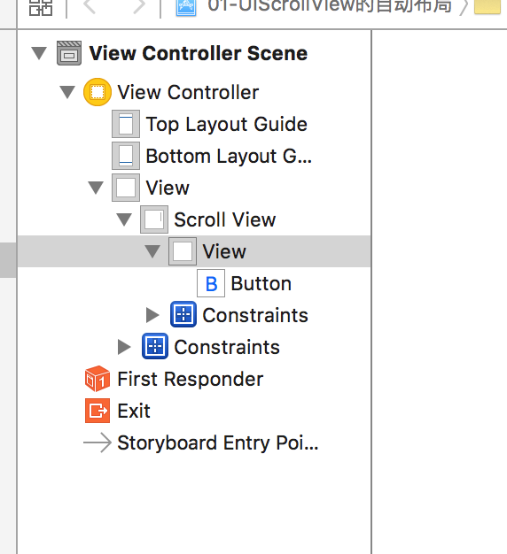

# UIScrollView的自动布局

做法:(无需代码)

ScrollView 上添加一个 View, 然后设置约束, 让 View 布满 ScrollView. 如果想 ScrollView 水平滚动, 则修改 View 的宽度约束, 比如设置为2倍原来的宽度, 则 ScrollView 就会在水平方向上滚动, 滚动的范围为 View 的宽度.设置上下滚动的话, 也是这样的思路.

    /*
    UIScrollView自动布局:首先要去确定UIScrollView的滚动范围,通过stroyboard去确定UIScrollView的滚动范围
    1.往UIScrollView拖入一个view,用于确定UIScrollView的滚动范围

    水平滚动范围: view的宽度 + 左右两边间距 就能确定UIScrollView水平滚动范围
    垂直滚动范围  view的高度 + 上下两边间距
    */

结构:

