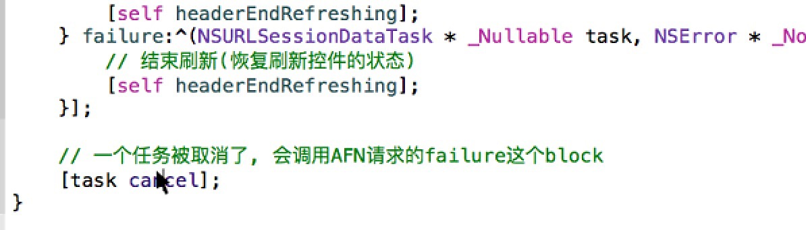
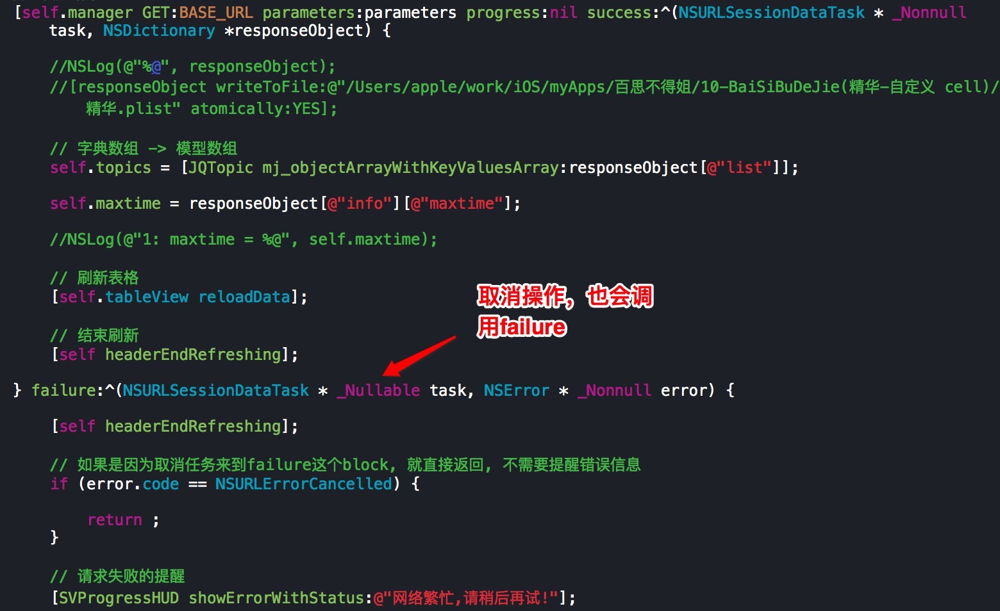
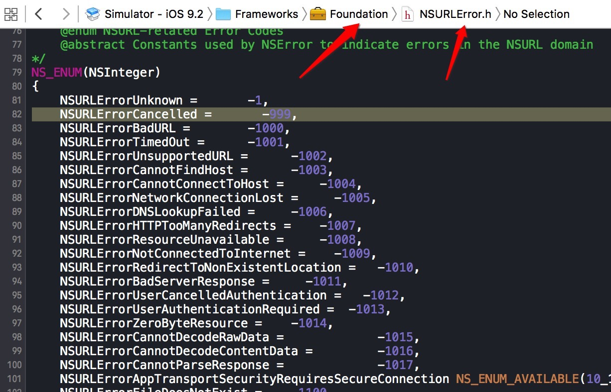

### AFN请求失败

注意点：

- 一个任务被取消了，也会调用AFN请求的failure这个block
- **
**

- 网络状态：在Foundation框架中的NSURLError.h
```objc
    NSURLErrorUnknown = 			-1,
    NSURLErrorCancelled = 			-999,
    NSURLErrorBadURL = 				-1000,
    NSURLErrorTimedOut = 			-1001,
    NSURLErrorUnsupportedURL = 			-1002,
    NSURLErrorCannotFindHost = 			-1003,
    NSURLErrorCannotConnectToHost = 		-1004,
    NSURLErrorNetworkConnectionLost = 		-1005,
    NSURLErrorDNSLookupFailed = 		-1006,
    NSURLErrorHTTPTooManyRedirects = 		-1007,
    NSURLErrorResourceUnavailable = 		-1008,
    NSURLErrorNotConnectedToInternet = 		-1009,
    NSURLErrorRedirectToNonExistentLocation = 	-1010,
    NSURLErrorBadServerResponse = 		-1011,
    NSURLErrorUserCancelledAuthentication = 	-1012,
    ...
```
**
