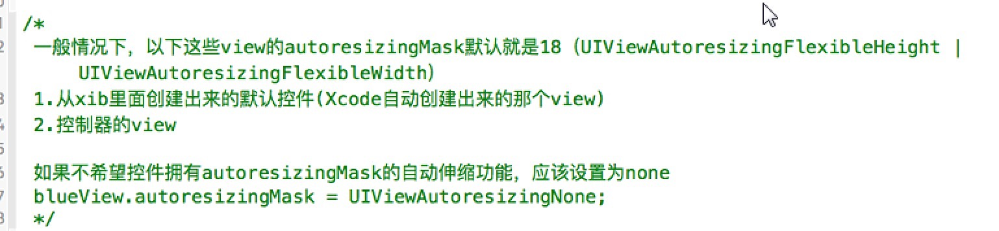

###view的自动拉伸属性

- autoresizingMask，数值：
```objc
typedef NS_OPTIONS(NSUInteger, UIViewAutoresizing) {
    UIViewAutoresizingNone                 = 0,
    UIViewAutoresizingFlexibleLeftMargin   = 1 << 0,
    UIViewAutoresizingFlexibleWidth        = 1 << 1,
    UIViewAutoresizingFlexibleRightMargin  = 1 << 2,
    UIViewAutoresizingFlexibleTopMargin    = 1 << 3,
    UIViewAutoresizingFlexibleHeight       = 1 << 4,
    UIViewAutoresizingFlexibleBottomMargin = 1 << 5
};
```

注意点：
**
