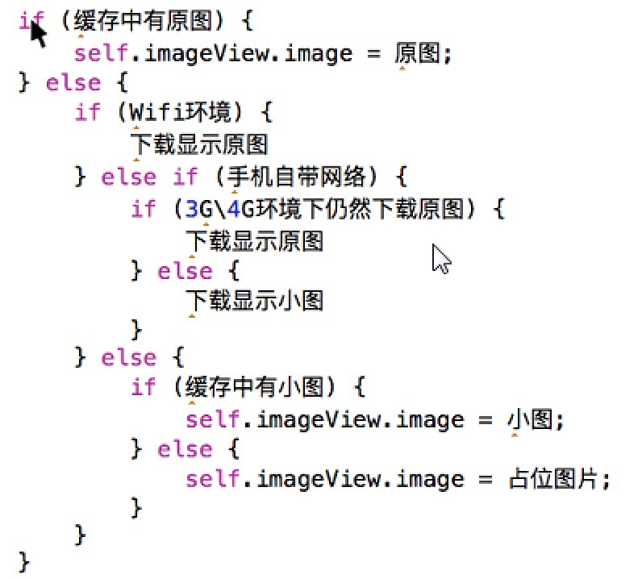

###根据网络状态加载图片
####一般流程:
- 1.从内存/沙盒缓存中获取原图
	- 1.1.有，直接获取，设置
	- 1.2.没有，2步骤
- 2.判断网络状态
	- 2.1. wifi下，直接下载原图
	- 2.2. 3G/4G下，判断是否设置了仍然下载原图
		- 2.2.1. 是：下载原图
		- 2.2.2. 否：下载小图
	- 2.3. 没有网络，判断缓存中是否有小图
		- 2.3.1 有，直接设置小图
		- 2.3.2 否，设置占位图

####伪代码:

<div>
</div>

####注意点
`为什么存储的时候, 不直接赋值?`

 sd_setImageWithURL:placeholderImage:方法的执行步骤

 - 1.取消当前imageView之前关联的请求
 - 2.设置占位图片到当前imageView上面
 - 3.如果缓存中有对应的图片，那么就显示到当前imageView上面
 - 4.如果缓存中没有对应的图片，发送请求给服务器下载图片

####基本过程：
```objc
// 占位图片
    UIImage *placehloderImage = nil;

    // 从内存/沙盒缓存中获取原图
    UIImage *originalImage = [[SDImageCache sharedImageCache] imageFromDiskCacheForKey:topic.image1];

    if (originalImage) { // 如果内存/沙盒缓存中有原图，则直接显示原图，不管现在是什么网络状态

        [self.imageView sd_setImageWithURL:[NSURL URLWithString:topic.image1] placeholderImage:placehloderImage];

    }else{ // 内存/沙盒缓存中没有原图，则根据网络状态获取图片

        AFNetworkReachabilityManager *netMgr = [AFNetworkReachabilityManager sharedManager];

        if (netMgr.isReachableViaWiFi) { // wifi下，直接下载原图

            [self.imageView sd_setImageWithURL:[NSURL URLWithString:topic.image1] placeholderImage:placehloderImage];

        }else if(netMgr.isReachableViaWWAN){ // 手机自带网络（3G/4G）

            // 获取用户配置，判断是否在手机自带网络下都下载原图
#warning 从沙盒中读取用户的配置项：在3G\4G环境是否仍然下载原图
            BOOL alwaysDownloadOriginalImage = [[NSUserDefaults standardUserDefaults] boolForKey:AlwaysDownloadOriginalImage];

            if (alwaysDownloadOriginalImage) {

                // 下载原图
                [self.imageView sd_setImageWithURL:[NSURL URLWithString:topic.image1] placeholderImage:placehloderImage];
            }else{

                // 下载小图
                [self.imageView sd_setImageWithURL:[NSURL URLWithString:topic.image0] placeholderImage:placehloderImage];
            }


        }else{ // 没有网络

            // 从内存/沙盒缓存中获取小图，如果有小图，则显示小图；没有小图，则显示占位图
            UIImage *thumbnailImage = [[SDImageCache sharedImageCache] imageFromDiskCacheForKey:topic.image0];

            if (thumbnailImage) { // 有小图

                [self.imageView sd_setImageWithURL:[NSURL URLWithString:topic.image0] placeholderImage:placehloderImage];

            }else{ // 没有小图

                [self.imageView sd_setImageWithURL:nil placeholderImage:placehloderImage];
            }
        }
    }
```

