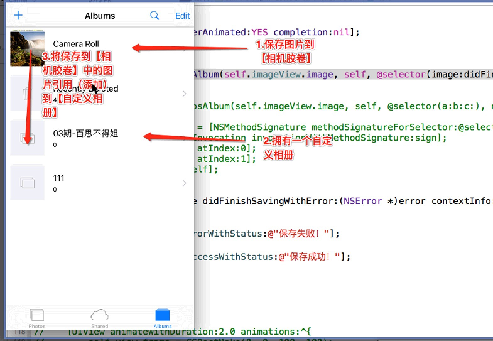

### 保存图片到系统胶卷Camera Roll

####1.图片保存到相册的步骤：
- 注意:
    - 只能是先把图片保存到 Camera Roll, 再通过操作, 保存到自定义的相册中
    - 自定义相册中的图片, 实质是 Camera Roll 中的图片的引用, 删除自定义中的图片, 并不会影响 到Camera Roll, 但删除 Camera Roll, 会影响到自定义相册

**

####2.调用方法

C 语言的方法:`UIImageWriteToSavedPhotosAlbum`
```objc
UIKIT_EXTERN void UIImageWriteToSavedPhotosAlbum(UIImage *image, __nullable id completionTarget, __nullable SEL completionSelector, void * __nullable contextInfo) __TVOS_PROHIBITED;
```

注意:
- @selector 必须是这种类型的方法

```objc
- (void)image:(UIImage *)image didFinishSavingWithError:(NSError *)error contextInfo:(void *)contextInfo;
```

例子:
```objc
// 保存
- (IBAction)saveButtonDidClicked:(id)sender {

    // 保存到 系统相册胶卷
    UIImageWriteToSavedPhotosAlbum(self.imageView.image, self, @selector(image:didFinishSavingWithError:contextInfo:), nil);
}

- (void)image:(UIImage *)image didFinishSavingWithError:(NSError *)error contextInfo:(void *)contextInfo{

    if (error) {

        [SVProgressHUD showErrorWithStatus:@"保存失败"];
    }else{

        [SVProgressHUD showSuccessWithStatus:@"保存成功"];
    }

}
```
