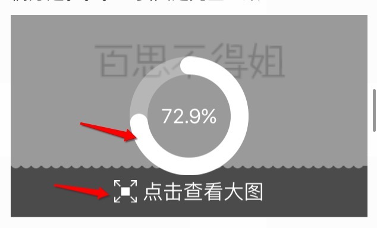

####1.SDWebImage清除缓存

```objc
#import <UIImageView+WebCache.h>

..
// 手动清除缓存
[[SDImageCache sharedImageCache] clearMemory];

..
```

####2.在 view 上执行 modal 操作
执行modal操作时，只能是在控制器上执行，如果是在 view 上，比如 xib de view，则可以直接获取窗口的根控制器，然后再执行modal
**

####3.modal细节注意
A modal B ==> A 必须在 window上，不在window上的话，会报类似的错误：
```objc
Attempt to present <UIAlertController: 0x7f893dd34270> on <ViewController: 0x7f893b557830> whose view is not in the window hierarchy
```

####4.cell 重用问题
通过 模型 来解决, 把 控件的状态量 记录到模型中, 根据加载的模型来处理界面控件 显示 还是 隐藏, 或者控件其他的显示样式

比如: 进度控件的显示或隐藏, 查看大图按钮显示或隐藏
**
