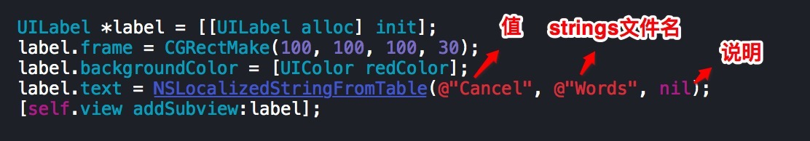
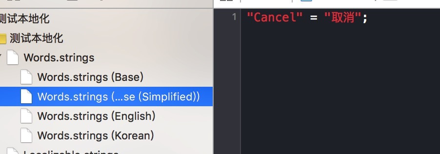
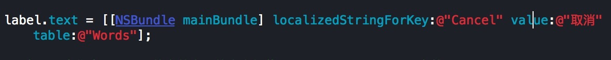
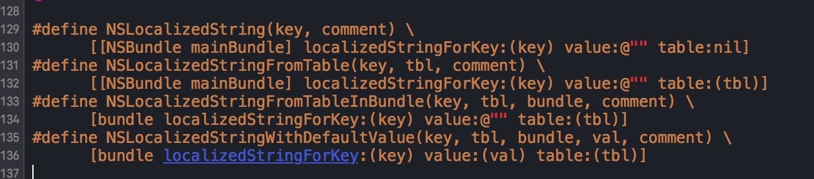

### 控件本地化

- 1.设置项目支持的语言

- 2.添加strings文件，并设置文件所支持的语言

- 3.修改控件的值 所对应的语言的 值，比如：

- 4.采用NSLocalizedStringFromTable方法，本地化控件的值

    (1)

(2)

- 或者采用NSBundle:

- 或者使用NSLocalizedString方法，本地化控件的值

- 注意：
    - 如果没有指定strings的文件名，就会去加载Localizable.strings文件
所以必须创建Localizable.strings文件（文件名规定，不能改）
然后  指定文件所支持的语言  和  设置控件值  所对应不同语言的  翻译值

- 细节：
    - 其实NSLocalizedStringFromTable 和 NSLocalizedString 是系统定义的宏， 实质还是采用NSBundle

