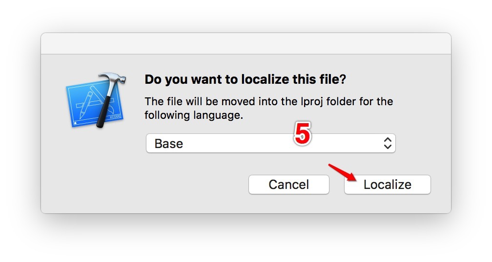

### App 名称本地化设置

"我的应用" 随手机语言的变化而变化

设置流程:

- 1. 设置项目支持的语言

- 2.新建一个`InfoPlist.strings`文件: （一定是`InfoPlist.strings`这个文件名）

- 3.设置文件所支持的语言：

- 勾选之后， 就有以下的列表：

- 4.指定各个文件 `CFBundleName` （一定是这个key, 对应的是Info.plist中的）所对应的值
    - 4.1）为什么要这个键 ？对应的是Info.plist中的：
    
    - 4.2）Base：当项目指定的语言都没有， 就会采用Base

    (1)
    
    (2)
    
