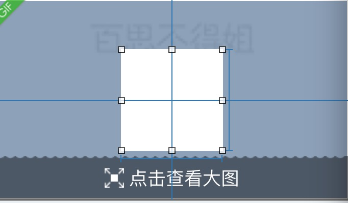
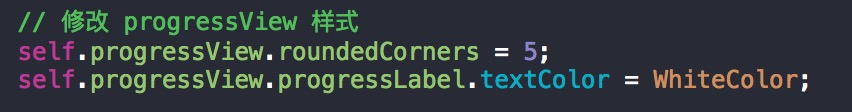
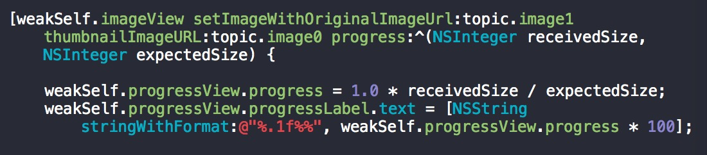

## 图片加载进度

#### 加载进度第三方工具: DACircularProgress

使用:
- 1.引入 DALabeledCircularProgressView.h

- 2.指定加载 view 的类型为 DALabeledCircularProgressView
比如:中间白色的 view


- 3.修改 progressView 的样式
```objc
self.progressView.roundedCorners = 5;
self.progressView.progressLabel.textColor = WhiteColor;
```


- 4.加载图片的时候, 修改 progressView 的进度
```objc
self.progressView.progress = 1.0 * receivedSize / expectedSize;
self.progressView.progressLabel.text = [NSString stringWithFormat:@"%.1f%%", weakSelf.progressView.progress * 100];
```

