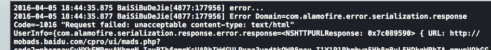
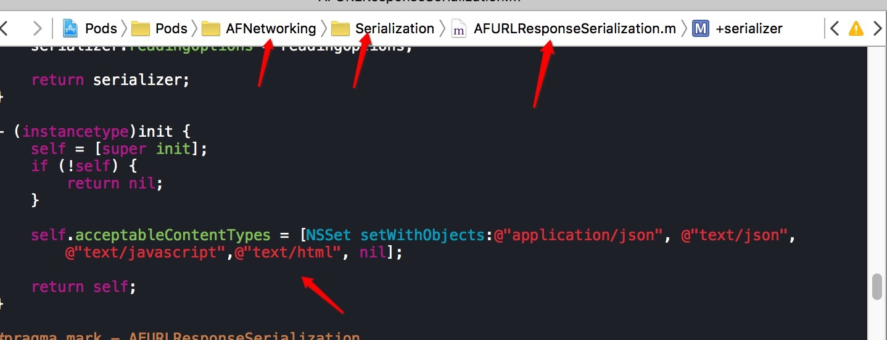
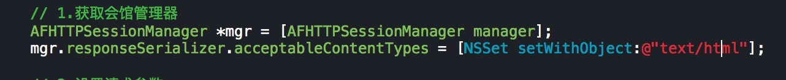
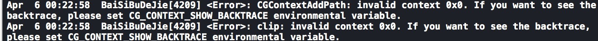
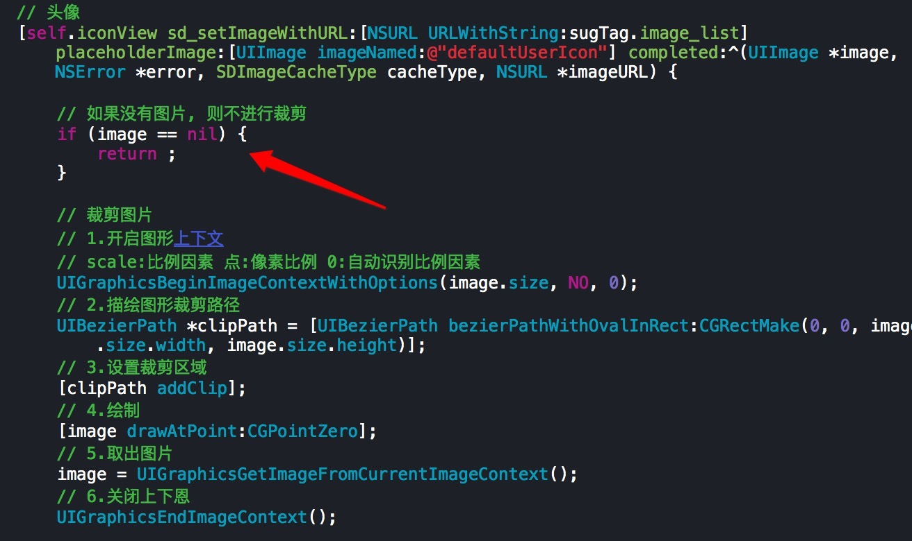
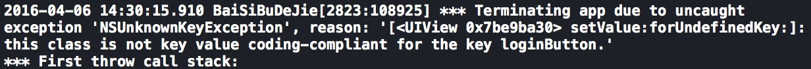
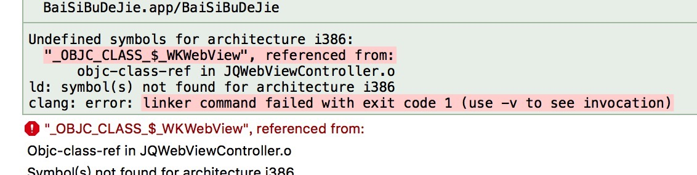

##报错

###1.AFN 使用, 不支持 text/html 类型




```objc
2016-04-05 18:44:35.875 BaiSiBuDeJie[4877:177956] error...
2016-04-05 18:44:35.877 BaiSiBuDeJie[4877:177956] Error Domain=com.alamofire.error.serialization.response Code=-1016 "Request failed: unacceptable content-type: text/html"
```

处理:
- 方式一: 修改 AFN 框架, 可以支持 text/html 类型


- 方式二: 修改会话管理器的 acceptableContentTypes


###2.裁剪图片:CGContextAddPath...


```objc
Apr  6 00:22:58  BaiSiBuDeJie[4209] <Error>: CGContextAddPath: invalid context 0x0. If you want to see the backtrace, please set CG_CONTEXT_SHOW_BACKTRACE environmental variable.
Apr  6 00:22:58  BaiSiBuDeJie[4209] <Error>: clip: invalid context 0x0. If you want to see the backtrace, please set CG_CONTEXT_SHOW_BACKTRACE environmental variable.
```

裁剪图片的时候, 报错 ?

原因: image == nil 时, 没有作处理

处理:



###3.xib没有指定 view 的类型


```objc
2016-04-06 14:30:15.910 BaiSiBuDeJie[2823:108925] *** Terminating app due to uncaught exception 'NSUnknownKeyException', reason: '[<UIView 0x7be9ba30> setValue:forUndefinedKey:]: this class is not key value coding-compliant for the key loginButton.'
*** First throw call stack:
```

处理:

xib 没有指定 view 的类型,指定 xib 的 view 类型

###4.使用 WebKit 报错



```objc
Undefined symbols for architecture i386:
  "_OBJC_CLASS_$_WKWebView", referenced from:
      objc-class-ref in JQWebViewController.o
ld: symbol(s) not found for architecture i386
clang: error: linker command failed with exit code 1 (use -v to see invocation)
```

处理:

导入 WebKit.framework 框架


###5.xib使用报错

