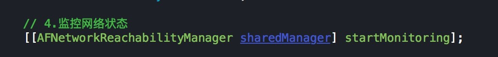
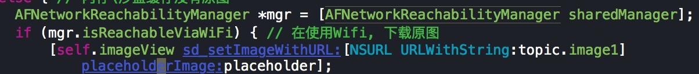

### AFN监控网络状态

所使用的类是：`AFNetworkReachabilityManager`

一般步骤:
- 1.开启监控（一般在AppDelegate中处理）
```objc
[[AFNetworkReachabilityManager sharedManager] startMonitoring];
```
**

- 2.判断不同的状态，执行操作
    - isReachable `网络可用`
    - isReachableViaWiFi `WIFI`
    - isReachableViaWWAN `手机自带网络3G/4G`
**
