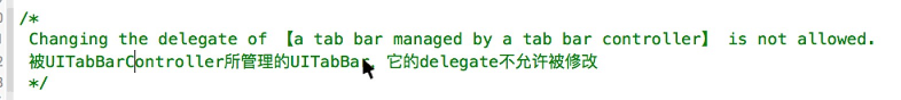
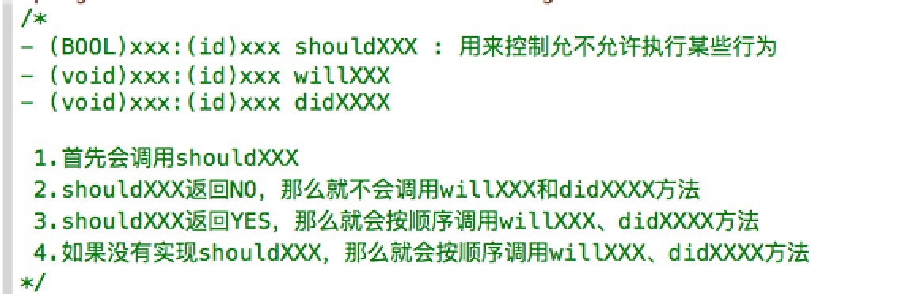
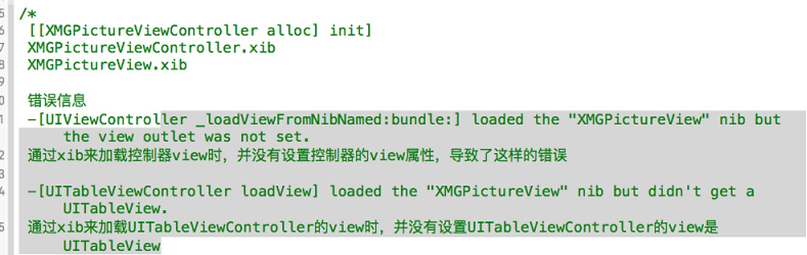
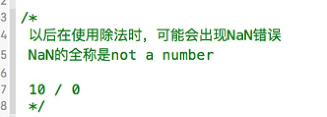
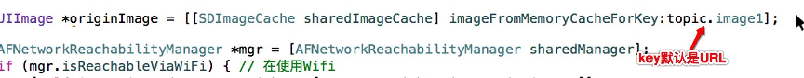

####1. appearance和appearanceWhenContainedIn

 iOS7,iOS8
 bug:把短信界面导航条改了,联系人界面会出现黑

优先使用:
appearanceWhenContainedIn

####2.广告标题按钮闪烁
通过定时器设置按钮的标题, 标题闪烁显示, 则把按钮的类型从 System 改成 Custom

####3.被UITabBarController所管理的UITabBar，它的delegate不允许被修改
**

####4.代理方法的方法执行的一般规律
**

####5.xib使用报错
**

####6.除法使用时要注意
**

####7.SDWebImage 从缓存中判断图片是否存在，key所指的是图片的url地址
**

####8.以后看到selector，要先点进去看看，有没有推荐的方法，有就采用
比如, 保存图片到系统相册 Camera Roll, @selector中的方法,必须是`- (void)image:(UIImage *)image didFinishSavingWithError:(NSError *)error contextInfo:(void *)contextInfo`这种类型的方法
```objc
// 保存
- (IBAction)saveButtonDidClicked:(id)sender {

    // 保存到 系统相册胶卷
    UIImageWriteToSavedPhotosAlbum(self.imageView.image, self, @selector(image:didFinishSavingWithError:contextInfo:), nil);
}

- (void)image:(UIImage *)image didFinishSavingWithError:(NSError *)error contextInfo:(void *)contextInfo{

    if (error) {

        [SVProgressHUD showErrorWithStatus:@"保存失败"];
    }else{

        [SVProgressHUD showSuccessWithStatus:@"保存成功"];
    }

}
```
