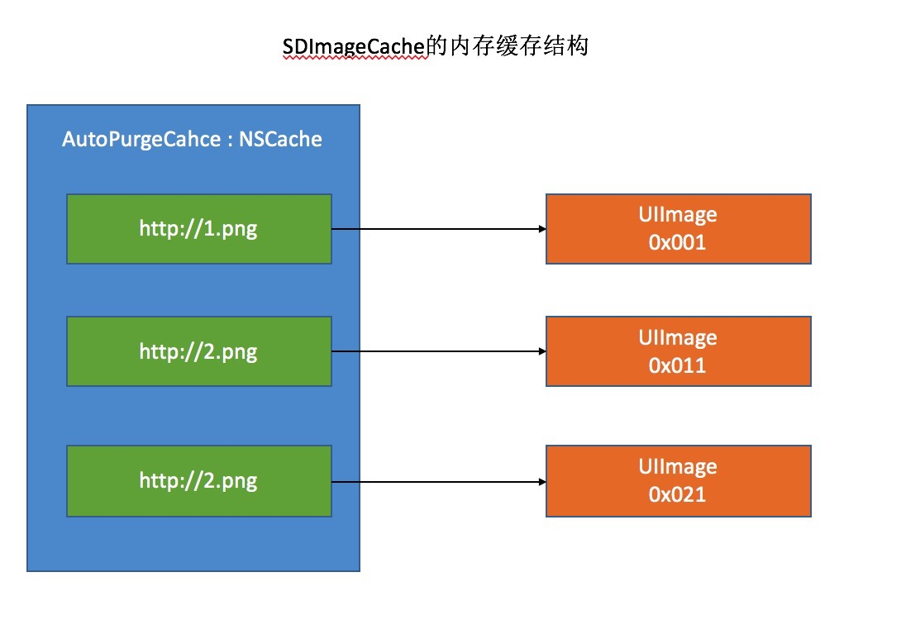
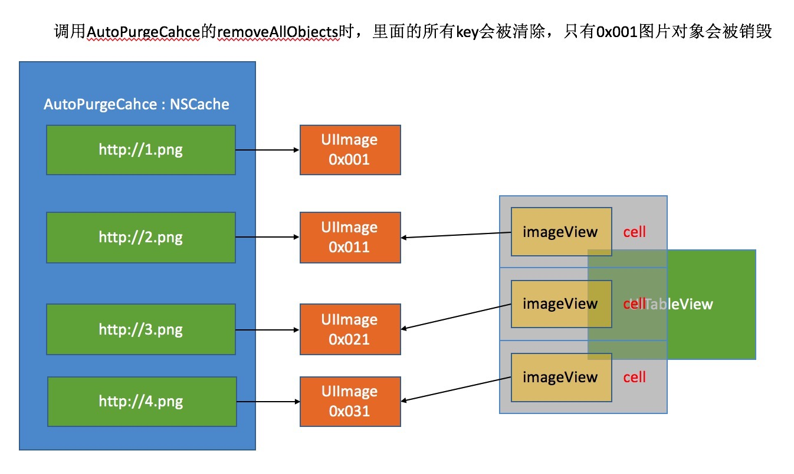

### SDImageCache的内存缓存结构

- SDWebImage缓存处理: 通过 `NSCache` 来处理
- NSCache 类似于字典, SDWebImage 处理缓存时, key所指的是图片的url地址, key 所执行的值是 UIImage 对象
**

- 为什么清除缓存后, 比如
```objc
    [[SDImageCache sharedImageCache] clearMemory];
```
当前显示的图片并没有被销毁 ?
**

原因:

```
执行清除缓存, 执行的操作是销毁 key 所指向 UIImage 的引用.
但是显示到界面上的图片, 已经被 UIImageView 强引用了, 所以不会被销毁
```

