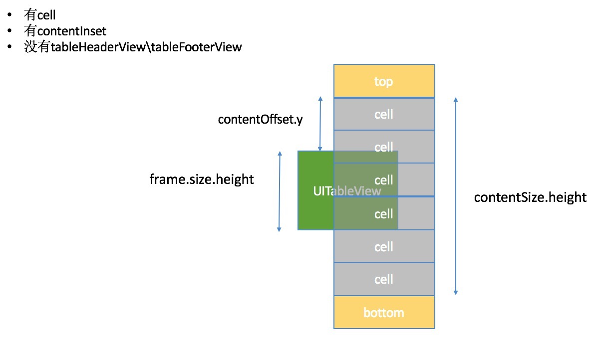

### tableView 的重要性
####一.什么是tableView的内容(content)?
- 1.Cell
- 2.tableHeaderView\tableFooterView
- 3.sectionHeader\sectionFooter

####二.contentSize.height : 内容的高度

####三.contentOffset.y : 内容的偏移量(frame的顶部 - content的顶部)
`向外偏移, 为正; 向内偏移, 为负. 比如, 由第一行滚动到最后一行, 为正; 由最后一行, 滚动到第一行, 为负`

####四.contentInset : 内容周围的间距(内边距)

####五.Frame
- 1.frame.size.height :  矩形框的高度
- 2.frame : 以父控件内容的左上角为坐标原点

####分析
**
**
**
**
**
**
**
**
**
**
