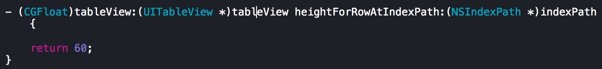
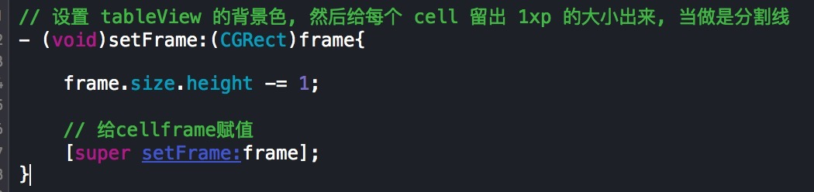

### tableView分隔线设置的一种方式

**

- tableView:
    - 1.设置 tableView 的背景色

    - 2.设置 tableView分隔线样式为 none
    **

    - 3.指定cell每行的高度
    **
- tableViewCell
    - 4.重写 tableViewCell 的 setFrame 方法, 然后在这个方法里面, 减小 frame 的高度的大小
    **
