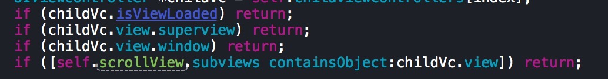

### 判断某个控制器的 view 是否已经被加载了
方式有 :
(假如控制器的 view 是加载到 scrollView上的)
```objc
    childVc.isViewLoaded

    childVc.view.superview

    childVc.view.window

    [self.scrollView.subviews containsObject:childVc.view]
```

**
