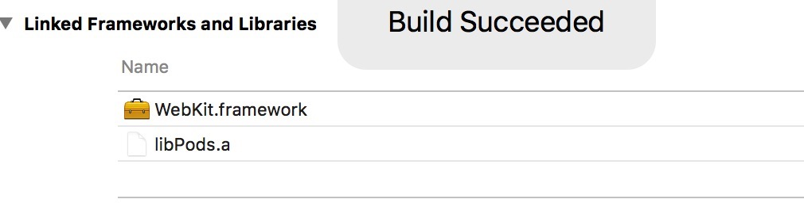

### WebKit的使用

- 1.导入 WebKit.framework 框架


- 2加载网页
```objc
WKWebView *webView = [[WKWebView alloc] initWithFrame:self.view.bounds];
    _webView = webView;
    [self.view insertSubview:webView atIndex:0];

    // 加载网页
    NSURLRequest *request = [NSURLRequest requestWithURL:_url];
    [webView loadRequest:request];

    // KVO: 让self对象监听webView的estimatedProgress
    [webView addObserver:self forKeyPath:@"estimatedProgress" options:NSKeyValueObservingOptionNew context:nil];
```

- 3.监听值变化
    ```objc
    // 只要监听的属性有新值就会调用
    - (void)observeValueForKeyPath:(NSString *)keyPath ofObject:(id)object change:(NSDictionary<NSString *,id> *)change context:(void *)context
{
    _progressView.progress = _webView.estimatedProgress;

    _progressView.hidden = _progressView.progress >= 1;
}
    ```
