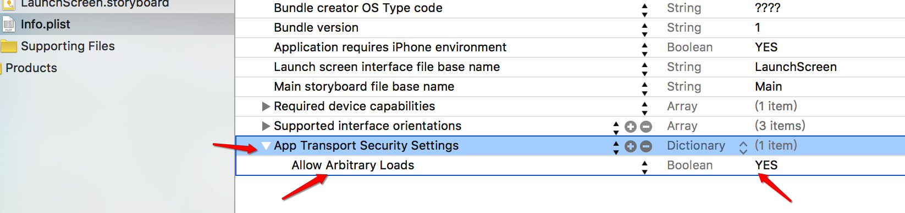

#06 线程间通信(下载图片)-掌握

- 线程间通信
    - 即在线程之间切换操作

- 案例:下载图片

```objc
#import "ViewController.h"

@interface ViewController ()

@property (weak, nonatomic) IBOutlet UIImageView *imageView;

@end

@implementation ViewController

-(void)touchesBegan:(NSSet<UITouch *> *)touches withEvent:(UIEvent *)event{

    self.automaticallyAdjustsScrollViewInsets = NO;

    // 开启一条子线程,执行download方法
    [NSThread detachNewThreadSelector:@selector(downLoad2) toTarget:self withObject:nil];
}

- (void) downLoad{
    // 1.确定url
    NSURL *url = [NSURL URLWithString:@"http://img4.duitang.com/uploads/blog/201310/18/20131018213446_smUw4.thumb.700_0.jpeg"];

    // 2.下载图片的二进制数据到本地
    NSData *data = [NSData dataWithContentsOfURL:url];

    // 3.转换格式 二进制数据转换UIimage
    UIImage *image = [UIImage imageWithData:data];

    // 4.回到主线程刷新UI
    /*
     第一个参数:调用的方法
     第二个参数:调用方法需要传递的参数
     第三个参数:是否等待调用的方法执行完毕
     */
    [self.imageView performSelectorOnMainThread:@selector(setImage:) withObject:image waitUntilDone:YES];

    //[self.imageView performSelector:@selector(setImage:) onThread:[NSThread mainThread] withObject:image waitUntilDone:YES];

}

@end
```

- 注意点:
    - 加载图片, 需要回到主线程中操作

- 传输安全提醒:
    - 提醒:

        “ **App Transport Security has blocked a cleartext HTTP (http://) resource load since it is insecure. Temporary exceptions can be configured via your app's Info.plist file.**"

    - 处理:修改 info.plist 文件

    

- 计算任务执行的时间

```objc
// 计算时间(方式一)
- (void) downLoad1{
    NSDate *start = [NSDate date];

    NSURL *url = [NSURL URLWithString:@"http://img4.duitang.com/uploads/blog/201310/18/20131018213446_smUw4.thumb.700_0.jpeg"];
    NSData *data = [NSData dataWithContentsOfURL:url];
    UIImage *image = [UIImage imageWithData:data];

    // 在 主线程中刷新 UI
    [self.imageView performSelector:@selector(setImage:) onThread:[NSThread mainThread] withObject:image waitUntilDone:YES];

    NSDate *end = [NSDate date];

    NSLog(@"所需时间:%lf", [end timeIntervalSinceDate:start]);
}

// 计算时间(方式二)
- (void) downLoad2{
    // 获得的时间是绝对时间
    CFTimeInterval start = CFAbsoluteTimeGetCurrent();

    NSURL *url = [NSURL URLWithString:@"http://img4.duitang.com/uploads/blog/201310/18/20131018213446_smUw4.thumb.700_0.jpeg"];
    NSData *data = [NSData dataWithContentsOfURL:url];
    UIImage *image = [UIImage imageWithData:data];

    // 在 主线程中刷新 UI
    [self.imageView performSelector:@selector(setImage:) onThread:[NSThread mainThread] withObject:image waitUntilDone:YES];

    CFTimeInterval end = CFAbsoluteTimeGetCurrent();

    NSLog(@"所需时间:%lf", end - start);

}
```
