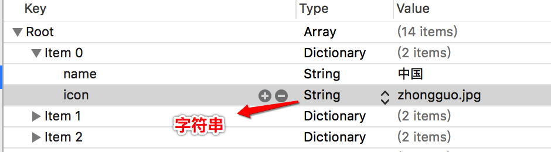
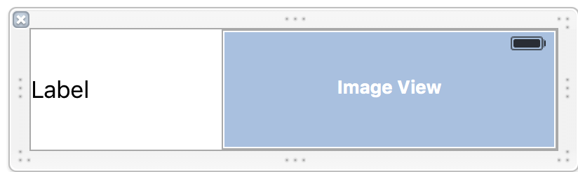
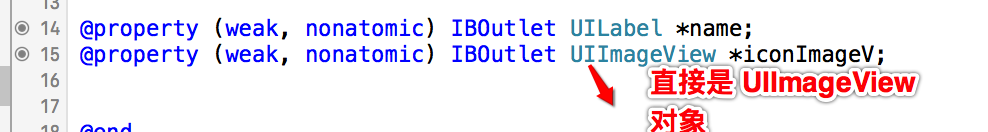
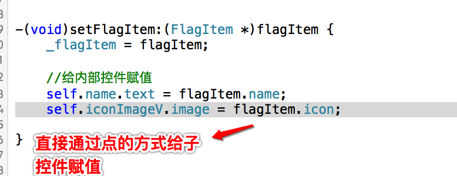
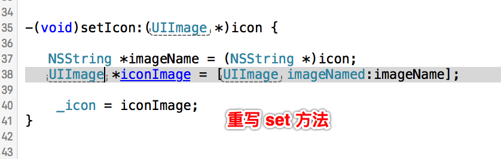

# day2
##01-控制器 view 的懒加载
####控制器 view 的懒加载实现的方式
```objc
- (UIView *)view{
    if (![self valueForKeyPath:@"_view"]) {
        [self loadView];
        [self viewDidLoad];
    }
    return [self valueForKeyPath:@"_view"];
}
```
当 view = nil 的时候,先执行 loadView 方法,然后再执行 veiwDidLoad 方法

##02-KVC的底层实现
####什么时候用到 KVC

<ol>
<li>给对象属性赋值</li>
<li>设置私有属性</li>
<li>字典转模型</li>
<li>...</li>
</ol>

####setValuesForKeysWithDictionary的实现细节

字典转模型的时候,一般都会用到:setValuesForKeysWithDictionary:这个方法

```objc
FlagItem *item = [[FlagItem alloc] init];
[item setValuesForKeysWithDictionary:dict];
```

setValuesForKeysWithDictionary底层实现:

```objc
[dict enumerateKeysAndObjectsUsingBlock:^(id  _Nonnull key, id  _Nonnull obj, BOOL * _Nonnull stop) {

    [item setValue:obj forKeyPath:key];
}];
```

然后,setValue: forKeyPath:的过程是:

<ol>
<li>先去看有没有跟key值相同的成员属性,如果有,就会调用该成员属性的set方法,给该成员属性赋值.</li>
<li>如果没有跟它相同的成员属性的set方法, 会直接给该属性赋值.</li>
<li>还会去判断有没有跟它相同名称,并且带有下划线的成员属性.如果有,就给该属性赋值.</li>
<li>如果没有带有下划线的成员属性,就会直接报错.</li>
</ol>

####使用
重写 set 方法,决定 KVC 所设置属性的赋值方式.

- 比如:
对 FlagItem 中的属性重写 set 方法,使得使用[item setValuesForKeysWithDictionary:dict];会调用重写的方法.

案例:
- 有这样一组数据



- 然后希望通过 xib 的方式来进行加载



- 接着,描述数据的实体类是这样的:我希望通过 点 的方式,直接设置图片自控件



- 即,给子控件赋值的形式是可以通过属性,点出来的,无需使用[UIImage imageName:icon.name]方式



- 然而,数据中 icon 是字符串,通过KVC, 设置属性的值的时候,传递过去的是一个字符串,所以需要重写 KVC中icon 属性的赋值方式:



##03-UITextField

####常用属性
- inputView
        键盘的显示方式

- inputAccessoryView
        键盘上方显示的工具条

####常用代理方法
- 是否允许编辑
```objc
 - (BOOL)textFieldShouldBeginEditing:(UITextField *)textField {
        return YES;
 }
```

- 开始编辑时调用
```objc
 - (void)textFieldDidBeginEditing:(UITextField *)textField {
 }
```

- 是否允许结束编辑
```objc
 - (BOOL)textFieldShouldEndEditing:(UITextField *)textField {
    return YES;
 }
```

- 当结束编辑时调用
```objc
 - (void)textFieldDidEndEditing:(UITextField *)textField {
     NSLog(@"%s",__func__);
}
```

- 是否允许改变文本的内容
```objc
 - (BOOL)textField:(UITextField *)textField shouldChangeCharactersInRange:(NSRange)range replacementString:(NSString *)string {
    return NO;
}
```

##04-UINavigationController导航控制器
####导航控制器的 View 的结构

<p>导航控制器它是一个控制器,它肯定有一个自己的View.</p>
<p>导航控制器标志, 就是上面一个条.这个条, 我们叫它导航条.这个导航条它是显示到导航控制器View的上面.</p>
<p>导航条的Y值是20的位置开始显示,上面20是状态栏的2位置.导航条的高度是44.</p>
<p>导航控制器的View当中,还有一个转门存放子控制器的View.</p>
<p>导航控制器的View上面有两层:最外面那一层是一个导航条,导航条下面是一个存放子控制器的View.</p>
<p>导航条的Y值是20,高度是44,但是我们看到的导航条有一个半透明的效果,它是从0位置开始的.</p>
<p>它其实是导航条内部的一个子控件,它超过了导航条的高度,子控件超过父控件也是能够显示的.</p>

####导航控制器的使用

<ol>
<li>初始化UINavigationController</li>
<li>设置UIWindow的rootViewController为UINavigationController</li>
<li>根据具体情况，通过push方法添加对应个数的子控制器</li>
</ol>

<p>可以通过push方法给导航控制器添加子控制器.</p>

```objc
- (void)pushViewController:(UIViewController *)viewController animated:(BOOL)animated;
```

<p>导航控制器会把子控制器的View添加到导航控制器专门存放子控制器的View上面.</p>

<p>导航控制器的initWithRootViewContorller:设置导航控制器的根控制器.</p>
<p>它其实底层调用的就是导航控制器的push方法,把传入的控制器子,添加为导航控制器的子控制器.</p>

<p>注意:导航控制器必须要有一个根控制器.</p>
<p>导航控制器的根控制器.就是导航控制器的子控制器.</p>
<p>导航控制器当中有一个childsViewControllers数组,数组当中存放的都是导航控制器的子控制器.</p>

####导航控制器的出栈

<p>导航控制器是以栈的形式管理子控制器的,也就是一个数组.</p>

<p>里面有两个一个是ViewControllers和ChildViewControllers两个, 都是数组, 保存的都是导航控制器的子控制器.</p>

<p>使用push方法就是把某个控制器压入到栈当中.
	使用pop方法可以移除控制器.</p>

<p>将栈顶的控制器移除</p>

```objc
- (UIViewController *)popViewControllerAnimated:(BOOL)animated;
```

<p>回到指定的子控制器</p>
<p>指定的控制器必须是导航控制器栈里面的控制器.</p>

```objc
- (NSArray *)popToViewController:(UIViewController *)viewController animated:(BOOL)animated;
```

<p>回到根控制器（栈底控制器）</p>

```objc
- (NSArray *)popToRootViewControllerAnimated:(BOOL)animated;
```

####导航控制器管理原则

程序一进入时,就要让窗口的根控制器是一个导航控制器.

<ol>
<li>新建窗口</li>
<li>创建导航控制器.并设置导航控制器的根控制器</li>
<li>把导航控制器设为窗口的根控制器.</li>
<li>显示窗口.</li>
</ol>


<p>说明:</p>
<p>1.当设置导航控制器的根控制器时,也就是initWithRootViewController,</p>
<p>它底层其实是调用了导航控制器的push方法.把该控制器添加为导航控制器的子控制器.</p>
<p>并且它会把该控制器的View添加到导航控制器专门存放子控制器的View上面.</p>
<p>2.把导航控制器设为窗口的根控制器时,它就会把导航控制器的View添加到窗口的View上面.</p>
<p>所以程序一运行时, 我们看到的就是一个导航控制器的View.</p>
<p>导航控制器的View内部默认有两个子view.一个是导航条, 一个是转专存放子控制器的View.</p>
<p>现在专门存放子控制器的View里面存放的就是导航控制器根控制器的View.</p>

<p>导航控制器的子控制器都是存放到一个栈中.也就是一个数组当中.</p>

<p>当调用导航控制器的push方法时,就会把一个控制器压入到导航控制器的栈中.</p>

<p>压入栈中是, 那么刚压入栈中的这个导航控制器就在栈的最顶部.</p>

<p>它就会把原来导航控制器View当中存放的子控制器View的内容移除,
然后把导航控制器栈顶控制器的View添加到导航控制器专门存放子控制器View当中.</p>

<p>注意:只是把控制器的View从导航控制器存放子控制器的View当中移除,并没有把控制器从栈中移除.所以上一个控制器还在.</p>

<p>当调用pop当方法时, 就会把导航控制器存放子控制器View当中控制器的View移除,并且会把该控制器从栈里面移除.</p>

<p>此时该控制器就会被销毁.接着它就会把上一个控制器的View添加到导航控制器专门存放子控制器的View当中.</p>

####设置导航条的内容

设置导航条的内容,由栈顶控制器的NavgationItem决定.

导航控制器必须要有根控制器.目的设置导航条的内容.

如果设置了导航条的标题, 那么下一个push的子控制器的返回按钮就是上一个控制器的标题.

UINavigationItem有以下属性影响着导航栏的内容


__左上角的返回按钮__

```objc
@property(nonatomic,retain) UIBarButtonItem *backBarButtonItem;
```

__中间的标题视图__

```objc
@property(nonatomic,retain) UIView *titleView;
```

__中间的标题文字__

```objc
@property(nonatomic,copy)   NSString  *title;
```

__左上角的视图__

```objc
@property(nonatomic,retain) UIBarButtonItem *leftBarButtonItem;
```

__右上角的视图__

```objc
@property(nonatomic,retain) UIBarButtonItem *rightBarButtonItem;
```

__设置导航条标题__

```objc
self.navigationItem.title = @"导航条标题"
```

导航条上面的子控件位置由系统决定,我们自己只能决定控件的尺寸

```objc
UIView *view = [[UIView alloc] initWithFrame:CGRectMake(0, 2000, 200, 35)];
view.backgroundColor = [UIColor redColor];
```

导航条的标题可以是一个自定义的UIView.

```objc
self.navigationItem.titleView = view;
```


设置导航条左边的内容为标题.

Title:设置的标题

style:样式,从ios7之后,这个地方设置什么都没有用了,
所以让它默认,它是一个枚举,直接可以写0.

target: action: 点击时调用哪个对象的哪个方法.

```objc
UIBarButtonItem *item = [[UIBarButtonItem alloc] initWithTitle:@"返回" style:0 target:self action:@selector(back)];
```

设置左边的内容为图片

initWithImage:要显示的图片.

style:样式,从ios7之后,这个地方设置什么都没有用了, 所以让它默认,它是一个枚举,直接可以写0.

target: action: 点击时调用哪个对象的哪个方法.

```objc
UIBarButtonItem *item1 = [[UIBarButtonItem alloc] initWithImage:image style:UIBarButtonItemStyleDone target:nil action:nil];
```

显示多张图片,不同状态,用按钮

```objc
UIButton *btn = [UIButton buttonWithType:UIButtonTypeCustom];
```
设置按钮正常状态下显示的图片

```objc
[btn setImage:[UIImage imageNamed:@"navigationbar_friendsearch"] forState:UIControlStateNormal];
```

设置按钮高亮状态下显示的图片

```objc
[btn setImage:[UIImage imageNamed:@"navigationbar_friendsearch_highlighted"] forState:UIControlStateHighlighted];
```

按钮自适应,根据当中的图片标题自动计算尺寸

```objc
[btn sizeToFit];
```

让导航条左侧或者右侧显示一个UIView.

```objc
initWithCustomView:要显示的View.
UIBarButtonItem *item = [[UIBarButtonItem alloc] initWithCustomView:btn];
```

可以设置左右的内容为多个Item.

```objc
self.navigationItem.rightBarButtonItems = @[item,item1,item2];
```

